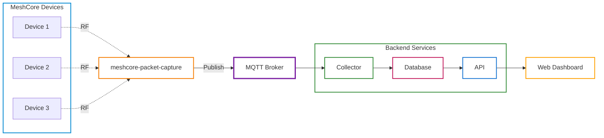

# MeshCore Hub

[](https://github.com/ipnet-mesh/meshcore-hub/actions/workflows/ci.yml)
[](https://github.com/ipnet-mesh/meshcore-hub/actions/workflows/docker.yml)
[](https://codecov.io/github/ipnet-mesh/meshcore-hub)
[](https://www.buymeacoffee.com/jinglemansweep)

Python 3.13+ platform for managing and orchestrating MeshCore mesh networks.


> [!IMPORTANT]
> **Help Translate MeshCore Hub** 🌍
>
> We need volunteers to translate the web dashboard! Currently only English is available. Check out the [Translation Guide](src/meshcore_hub/web/static/locales/languages.md) to contribute a language pack. Partial translations welcome!

## Overview

MeshCore Hub provides a complete solution for monitoring, collecting, and interacting with MeshCore mesh networks. Data ingestion is handled by [meshcore-packet-capture](https://github.com/agessaman/meshcore-packet-capture), which observes MeshCore RF traffic and publishes decoded packets to MQTT. It consists of multiple components that work together:

| Component | Description |
|-----------|-------------|
| **Collector** | Subscribes to MQTT events and persists them to a database |
| **API** | REST API for querying data and sending commands to the network |
| **Web Dashboard** | Single Page Application (SPA) for visualizing network status |

## Architecture



## Features

- **Event Persistence**: Store messages, advertisements, telemetry, and trace data
- **REST API**: Query historical data with filtering and pagination
- **Command Dispatch**: Send messages and advertisements via the API
- **Node Tagging**: Add custom metadata to nodes for organization
- **Web Dashboard**: Visualize network status, node locations, and message history
- **Internationalization**: Full i18n support with composable translation patterns
- **Docker Ready**: Single image with all components, easy deployment

## Getting Started

### Simple Self-Hosted Setup

The quickest way to get started is running the entire stack on a single machine alongside [meshcore-packet-capture](https://github.com/agessaman/meshcore-packet-capture).

**Prerequisites:**
1. Set up [meshcore-packet-capture](https://github.com/agessaman/meshcore-packet-capture) on a device with a compatible LoRa radio (e.g., Heltec V3, T-Beam) to observe MeshCore RF traffic

**Steps:**
```bash
# Create a directory, download the Docker Compose file and
# example environment configuration file

mkdir meshcore-hub
cd meshcore-hub
wget https://raw.githubusercontent.com/ipnet-mesh/meshcore-hub/refs/heads/main/docker-compose.yml
wget https://raw.githubusercontent.com/ipnet-mesh/meshcore-hub/refs/heads/main/.env.example

# Copy and configure environment
cp .env.example .env
# Edit .env: set MQTT_HOST to your MQTT broker if not using the local one

# Start the entire stack with local MQTT broker
docker compose --profile mqtt --profile core up -d

# View the web dashboard
open http://localhost:8080
```

This starts all services: MQTT broker, collector, API, and web dashboard. MeshCore packet data is ingested via [meshcore-packet-capture](https://github.com/agessaman/meshcore-packet-capture), which publishes decoded packets to MQTT.

## Deployment

### Docker Compose Profiles

Docker Compose uses **profiles** to select which services to run:

| Profile | Services | Use Case |
|---------|----------|----------|
| `all` | db-migrate, collector, api, web | Everything on one host |
| `core` | db-migrate, collector, api, web | Central server infrastructure |
| `mqtt` | mosquitto broker | Local MQTT broker (optional) |
| `receiver` | packet capture observer | Observes RF traffic and publishes to MQTT |
| `metrics` | prometheus, alertmanager | Prometheus metrics and alerting |
| `seed` | seed | One-time seed data import |
| `migrate` | db-migrate | One-time database migration |

**Note:** Most deployments connect to an external MQTT broker. Add `--profile mqtt` only if you need a local broker. The `receiver` profile runs [meshcore-packet-capture](https://github.com/agessaman/meshcore-packet-capture) to observe MeshCore RF traffic and publish decoded packets to MQTT.

```bash
# Create database schema
docker compose --profile migrate run --rm db-migrate

# Seed the database
docker compose --profile seed run --rm seed

# Start core services with local MQTT broker
docker compose --profile mqtt --profile core up -d

# Or connect to external MQTT (configure MQTT_HOST in .env)
docker compose --profile core up -d

# Start everything including packet capture observer
docker compose --profile mqtt --profile core --profile receiver up -d

# View logs
docker compose logs -f

# Stop services
docker compose down
```

### Manual Installation

```bash
# Create virtual environment
python -m venv .venv
source .venv/bin/activate

# Install the package
pip install -e ".[dev]"

# Run database migrations
meshcore-hub db upgrade

# Start components (in separate terminals)
meshcore-hub collector
meshcore-hub api
meshcore-hub web
```

## Configuration

All components are configured via environment variables. Create a `.env` file or export variables:

### Common Settings

| Variable | Default | Description |
|----------|---------|-------------|
| `LOG_LEVEL` | `INFO` | Logging level (DEBUG, INFO, WARNING, ERROR) |
| `DATA_HOME` | `./data` | Base directory for runtime data |
| `SEED_HOME` | `./seed` | Directory containing seed data files |
| `MQTT_HOST` | `localhost` | MQTT broker hostname |
| `MQTT_PORT` | `1883` | MQTT broker port |
| `MQTT_USERNAME` | *(none)* | MQTT username (optional) |
| `MQTT_PASSWORD` | *(none)* | MQTT password (optional) |
| `MQTT_PREFIX` | `meshcore` | Topic prefix for all MQTT messages |
| `MQTT_TLS` | `false` | Enable TLS/SSL for MQTT connection |
| `MQTT_TRANSPORT` | `tcp` | MQTT transport (`tcp` or `websockets`) |
| `MQTT_WS_PATH` | `/mqtt` | MQTT WebSocket path (used when `MQTT_TRANSPORT=websockets`) |

### Collector Settings

| Variable | Default | Description |
|----------|---------|-------------|
| `COLLECTOR_LETSMESH_DECODER_KEYS` | *(none)* | Additional decoder channel keys (`label=hex`, `label:hex`, or `hex`) |

#### LetsMesh Packet Decoding

The collector subscribes to packets published by [meshcore-packet-capture](https://github.com/agessaman/meshcore-packet-capture):

- `<prefix>/+/packets`
- `<prefix>/+/status`
- `<prefix>/+/internal`

Normalization behavior:

- `status` packets are stored as informational `letsmesh_status` events and are not mapped to `advertisement` rows.
- Decoder payload type `4` is mapped to `advertisement` when node identity metadata is present.
- Decoder payload type `11` (control discover response) is mapped to `contact`.
- Decoder payload type `9` is mapped to `trace_data`.
- Decoder payload type `8` is mapped to informational `path_updated` events.
- Decoder payload type `1` can map to native response events (`telemetry_response`, `battery`, `path_updated`, `status_response`) when decrypted structured content is available.
- `packet_type=5` packets are mapped to `channel_msg_recv`.
- `packet_type=1`, `2`, and `7` packets are mapped to `contact_msg_recv` when decryptable text is available.
- For channel packets, if a channel key is available, a channel label is attached (for example `Public` or `#test`) for UI display.
- In the messages feed and dashboard channel sections, known channel indexes are preferred for labels (`17 -> Public`, `217 -> #test`) to avoid stale channel-name mismatches.
- Additional channel names are loaded from `COLLECTOR_LETSMESH_DECODER_KEYS` when entries are provided as `label=hex` (for example `bot=<key>`).
- Decoder-advertisement packets with location metadata update node GPS (`lat/lon`) for map display.
- This keeps advertisement listings focused on node advert traffic only, not observer status telemetry.
- Packets without decryptable message text are kept as informational `letsmesh_packet` events and are not shown in the messages feed; when decode succeeds the decoded JSON is attached to those packet log events.
- When decoder output includes a human sender (`payload.decoded.decrypted.sender`), message text is normalized to `Name: Message` before storage; receiver/observer names are never used as sender fallback.
- The collector keeps built-in keys for `Public` and `#test`, and merges any additional keys from `COLLECTOR_LETSMESH_DECODER_KEYS`.
- Docker runtime uses the native Python `meshcoredecoder` library (no external Node.js dependency).

### Webhooks

The collector can forward certain events to external HTTP endpoints:

| Variable | Default | Description |
|----------|---------|-------------|
| `WEBHOOK_ADVERTISEMENT_URL` | *(none)* | Webhook URL for advertisement events |
| `WEBHOOK_ADVERTISEMENT_SECRET` | *(none)* | Secret sent as `X-Webhook-Secret` header |
| `WEBHOOK_MESSAGE_URL` | *(none)* | Webhook URL for all message events |
| `WEBHOOK_MESSAGE_SECRET` | *(none)* | Secret for message webhook |
| `WEBHOOK_CHANNEL_MESSAGE_URL` | *(none)* | Override URL for channel messages only |
| `WEBHOOK_CHANNEL_MESSAGE_SECRET` | *(none)* | Secret for channel message webhook |
| `WEBHOOK_DIRECT_MESSAGE_URL` | *(none)* | Override URL for direct messages only |
| `WEBHOOK_DIRECT_MESSAGE_SECRET` | *(none)* | Secret for direct message webhook |
| `WEBHOOK_TIMEOUT` | `10.0` | Request timeout in seconds |
| `WEBHOOK_MAX_RETRIES` | `3` | Max retry attempts on failure |
| `WEBHOOK_RETRY_BACKOFF` | `2.0` | Exponential backoff multiplier |

Webhook payload format:
```json
{
  "event_type": "advertisement",
  "public_key": "abc123...",
  "payload": { ... event data ... }
}
```

### Data Retention

The collector automatically cleans up old event data and inactive nodes:

| Variable | Default | Description |
|----------|---------|-------------|
| `DATA_RETENTION_ENABLED` | `true` | Enable automatic cleanup of old events |
| `DATA_RETENTION_DAYS` | `30` | Days to retain event data |
| `DATA_RETENTION_INTERVAL_HOURS` | `24` | Hours between cleanup runs |
| `NODE_CLEANUP_ENABLED` | `true` | Enable removal of inactive nodes |
| `NODE_CLEANUP_DAYS` | `7` | Remove nodes not seen for this many days |

### API Settings

| Variable | Default | Description |
|----------|---------|-------------|
| `API_HOST` | `0.0.0.0` | API bind address |
| `API_PORT` | `8000` | API port |
| `API_READ_KEY` | *(none)* | Read-only API key |
| `API_ADMIN_KEY` | *(none)* | Admin API key (required for commands) |
| `METRICS_ENABLED` | `true` | Enable Prometheus metrics endpoint at `/metrics` |
| `METRICS_CACHE_TTL` | `60` | Seconds to cache metrics output (reduces database load) |

### Web Dashboard Settings

| Variable | Default | Description |
|----------|---------|-------------|
| `WEB_HOST` | `0.0.0.0` | Web server bind address |
| `WEB_PORT` | `8080` | Web server port |
| `API_BASE_URL` | `http://localhost:8000` | API endpoint URL |
| `API_KEY` | *(none)* | API key for web dashboard queries (optional) |
| `WEB_THEME` | `dark` | Default theme (`dark` or `light`). Users can override via theme toggle in navbar. |
| `WEB_LOCALE` | `en` | Locale/language for the web dashboard (e.g., `en`, `es`, `fr`) |
| `WEB_DATETIME_LOCALE` | `en-US` | Locale used for date formatting in the web dashboard (e.g., `en-US` for MM/DD/YYYY, `en-GB` for DD/MM/YYYY). |
| `WEB_AUTO_REFRESH_SECONDS` | `30` | Auto-refresh interval in seconds for list pages (0 to disable) |
| `WEB_ADMIN_ENABLED` | `false` | Enable admin interface at /a/ (requires auth proxy: `X-Forwarded-User`/`X-Auth-Request-User` or forwarded `Authorization: Basic ...`) |
| `WEB_TRUSTED_PROXY_HOSTS` | `*` | Comma-separated list of trusted proxy hosts for admin authentication headers. Default: `*` (all hosts). Recommended: set to your reverse proxy IP in production. A startup warning is emitted when using the default `*` with admin enabled. |
| `TZ` | `UTC` | Timezone for displaying dates/times (e.g., `America/New_York`, `Europe/London`) |
| `NETWORK_DOMAIN` | *(none)* | Network domain name (optional) |
| `NETWORK_NAME` | `MeshCore Network` | Display name for the network |
| `NETWORK_CITY` | *(none)* | City where network is located |
| `NETWORK_COUNTRY` | *(none)* | Country code (ISO 3166-1 alpha-2) |
| `NETWORK_RADIO_CONFIG` | *(none)* | Radio config (comma-delimited: profile,freq,bw,sf,cr,power) |
| `NETWORK_WELCOME_TEXT` | *(none)* | Custom welcome text for homepage |
| `NETWORK_CONTACT_EMAIL` | *(none)* | Contact email address |
| `NETWORK_CONTACT_DISCORD` | *(none)* | Discord server link |
| `NETWORK_CONTACT_GITHUB` | *(none)* | GitHub repository URL |
| `NETWORK_CONTACT_YOUTUBE` | *(none)* | YouTube channel URL |
| `CONTENT_HOME` | `./content` | Directory containing custom content (pages/, media/) |

Timezone handling note:
- API timestamps that omit an explicit timezone suffix are treated as UTC before rendering in the configured `TZ`.

#### Nginx Proxy Manager (NPM) Admin Setup

Use two hostnames so the public map/site stays open while admin stays protected:

1. Public host: no Access List (normal users).
2. Admin host: Access List enabled (operators only).

Both proxy hosts should forward to the same web container:
- Scheme: `http`
- Forward Hostname/IP: your MeshCore Hub host
- Forward Port: `18080` (or your mapped web port)
- Websockets Support: `ON`
- Block Common Exploits: `ON`

Important:
- Do not host this app under a subpath (for example `/meshcore`); proxy it at `/`.
- `WEB_ADMIN_ENABLED` must be `true`.

In NPM, for the **admin host**, paste this in the `Advanced` field:

```nginx
# Forward authenticated identity for MeshCore Hub admin checks
proxy_set_header Authorization $http_authorization;
proxy_set_header X-Forwarded-User $remote_user;
proxy_set_header X-Auth-Request-User $remote_user;
proxy_set_header X-Forwarded-Email "";
proxy_set_header X-Forwarded-Groups "";
```

Then attach your NPM Access List (Basic auth users) to that admin host.

Verify auth forwarding:

```bash
curl -s -u 'admin:password' "https://admin.example.com/config.js?t=$(date +%s)" \
  | grep -o '"is_authenticated":[^,]*'
```

Expected:

```text
"is_authenticated": true
```

If it still shows `false`, check:
1. You are using the admin hostname, not the public hostname.
2. The Access List is attached to that admin host.
3. The `Advanced` block above is present exactly.
4. `WEB_ADMIN_ENABLED=true` is loaded in the running web container.

#### Feature Flags

Control which pages are visible in the web dashboard. Disabled features are fully hidden: removed from navigation, return 404 on their routes, and excluded from sitemap/robots.txt.

| Variable | Default | Description |
|----------|---------|-------------|
| `FEATURE_DASHBOARD` | `true` | Enable the `/dashboard` page |
| `FEATURE_NODES` | `true` | Enable the `/nodes` pages (list, detail, short links) |
| `FEATURE_ADVERTISEMENTS` | `true` | Enable the `/advertisements` page |
| `FEATURE_MESSAGES` | `true` | Enable the `/messages` page |
| `FEATURE_MAP` | `true` | Enable the `/map` page and `/map/data` endpoint |
| `FEATURE_MEMBERS` | `true` | Enable the `/members` page |
| `FEATURE_PAGES` | `true` | Enable custom markdown pages |

**Dependencies:** Dashboard auto-disables when all of Nodes/Advertisements/Messages are disabled. Map auto-disables when Nodes is disabled.

### Custom Content

The web dashboard supports custom content including markdown pages and media files. Content is organized in subdirectories:

Custom logo options:
- `logo.svg` — full-color logo, displayed as-is in both themes (no automatic darkening)
- `logo-invert.svg` — monochrome/two-tone logo, automatically darkened in light mode for visibility
```
content/
├── pages/     # Custom markdown pages
│   └── about.md
└── media/     # Custom media files
    └── images/
        ├── logo.svg          # Full-color custom logo (default)
        └── logo-invert.svg   # Monochrome custom logo (darkened in light mode)
```

**Setup:**
```bash
# Create content directory structure
mkdir -p content/pages content/media

# Create a custom page
cat > content/pages/about.md << 'EOF'
---
title: About Us
slug: about
menu_order: 10
---

# About Our Network

Welcome to our MeshCore mesh network!

## Getting Started

1. Get a compatible LoRa device
2. Flash MeshCore firmware
3. Configure your radio settings
EOF
```

**Frontmatter fields:**
| Field | Default | Description |
|-------|---------|-------------|
| `title` | Filename titlecased | Browser tab title and navigation link text (not rendered on page) |
| `slug` | Filename without `.md` | URL path (e.g., `about` → `/pages/about`) |
| `menu_order` | `100` | Sort order in navigation (lower = earlier) |

The markdown content is rendered as-is, so include your own `# Heading` if desired.

Pages automatically appear in the navigation menu and sitemap. With Docker, mount the content directory:

```yaml
# docker-compose.yml (already configured)
volumes:
  - ${CONTENT_HOME:-./content}:/content:ro
environment:
  - CONTENT_HOME=/content
```

## Seed Data

The database can be seeded with node tags and network members from YAML files in the `SEED_HOME` directory (default: `./seed`).

#### Running the Seed Process

Seeding is a separate process and must be run explicitly:

```bash
docker compose --profile seed up
```

This imports data from the following files (if they exist):
- `{SEED_HOME}/node_tags.yaml` - Node tag definitions
- `{SEED_HOME}/members.yaml` - Network member definitions

#### Directory Structure

```
seed/                          # SEED_HOME (seed data files)
├── node_tags.yaml            # Node tags for import
└── members.yaml              # Network members for import

data/                          # DATA_HOME (runtime data)
└── collector/
    └── meshcore.db           # SQLite database
```

Example seed files are provided in `example/seed/`.

### Node Tags

Node tags allow you to attach custom metadata to nodes (e.g., location, role, owner). Tags are stored in the database and returned with node data via the API.

#### Node Tags YAML Format

Tags are keyed by public key in YAML format:

```yaml
# Each key is a 64-character hex public key
0123456789abcdef0123456789abcdef0123456789abcdef0123456789abcdef:
  name: Gateway Node
  description: Main network gateway
  role: gateway
  lat: 37.7749
  lon: -122.4194
  member_id: alice

fedcba9876543210fedcba9876543210fedcba9876543210fedcba9876543210:
  name: Oakland Repeater
  elevation: 150
```

Tag values can be:
- **YAML primitives** (auto-detected type): strings, numbers, booleans
- **Explicit type** (when you need to force a specific type):
  ```yaml
  altitude:
    value: "150"
    type: number
  ```

Supported types: `string`, `number`, `boolean`

### Network Members

Network members represent the people operating nodes in your network. Members can optionally be linked to nodes via their public key.

#### Members YAML Format

```yaml
- member_id: walshie86
  name: Walshie
  callsign: Walshie86
  role: member
  description: IPNet Member
- member_id: craig
  name: Craig
  callsign: M7XCN
  role: member
  description: IPNet Member
```

| Field | Required | Description |
|-------|----------|-------------|
| `member_id` | Yes | Unique identifier for the member |
| `name` | Yes | Member's display name |
| `callsign` | No | Amateur radio callsign |
| `role` | No | Member's role in the network |
| `description` | No | Additional description |
| `contact` | No | Contact information |
| `public_key` | No | Associated node public key (64-char hex) |

## API Documentation

When running, the API provides interactive documentation at:

- **Swagger UI**: http://localhost:8000/api/docs
- **ReDoc**: http://localhost:8000/api/redoc
- **OpenAPI JSON**: http://localhost:8000/api/openapi.json

Health check endpoints are also available:

- **Health**: http://localhost:8000/health
- **Ready**: http://localhost:8000/health/ready (includes database check)
- **Metrics**: http://localhost:8000/metrics (Prometheus format)

### Authentication

The API supports optional bearer token authentication:

```bash
# Read-only access
curl -H "Authorization: Bearer <API_READ_KEY>" http://localhost:8000/api/v1/nodes

# Admin access (required for commands)
curl -X POST \
  -H "Authorization: Bearer <API_ADMIN_KEY>" \
  -H "Content-Type: application/json" \
  -d '{"destination": "abc123...", "text": "Hello!"}' \
  http://localhost:8000/api/v1/commands/send-message
```

### Example Endpoints

| Method | Endpoint | Description |
|--------|----------|-------------|
| GET | `/api/v1/nodes` | List all known nodes |
| GET | `/api/v1/nodes/{public_key}` | Get node details |
| GET | `/api/v1/nodes/prefix/{prefix}` | Get node by public key prefix |
| GET | `/api/v1/nodes/{public_key}/tags` | Get node tags |
| POST | `/api/v1/nodes/{public_key}/tags` | Create node tag |
| GET | `/api/v1/messages` | List messages with filters |
| GET | `/api/v1/advertisements` | List advertisements |
| GET | `/api/v1/telemetry` | List telemetry data |
| GET | `/api/v1/trace-paths` | List trace paths |
| GET | `/api/v1/members` | List network members |
| POST | `/api/v1/commands/send-message` | Send direct message |
| POST | `/api/v1/commands/send-channel-message` | Send channel message |
| POST | `/api/v1/commands/send-advertisement` | Send advertisement |
| GET | `/api/v1/dashboard/stats` | Get network statistics |
| GET | `/api/v1/dashboard/activity` | Get daily advertisement activity |
| GET | `/api/v1/dashboard/message-activity` | Get daily message activity |
| GET | `/api/v1/dashboard/node-count` | Get cumulative node count history |

## Development

### Setup

```bash
# Clone and setup
git clone https://github.com/ipnet-mesh/meshcore-hub.git
cd meshcore-hub
python -m venv .venv
source .venv/bin/activate
pip install -e ".[dev]"

# Install pre-commit hooks
pre-commit install
```

### Running Tests

```bash
# Run all tests
pytest

# Run with coverage
pytest --cov=meshcore_hub --cov-report=html

# Run specific test file
pytest tests/test_api/test_nodes.py

# Run tests matching pattern
pytest -k "test_list"
```

### Code Quality

```bash
# Run all code quality checks (formatting, linting, type checking)
pre-commit run --all-files
```

### Creating Database Migrations

```bash
# Auto-generate migration from model changes
meshcore-hub db revision --autogenerate -m "Add new field to nodes"

# Create empty migration
meshcore-hub db revision -m "Custom migration"

# Apply migrations
meshcore-hub db upgrade
```

## Project Structure

```
meshcore-hub/
├── src/meshcore_hub/       # Main package
│   ├── common/             # Shared code (models, schemas, config)
│   ├── collector/          # MQTT event collector
│   ├── api/                # REST API
│   └── web/                # Web dashboard
│       ├── templates/      # Jinja2 templates (SPA shell)
│       └── static/
│           ├── js/spa/     # SPA frontend (ES modules, lit-html)
│           └── locales/    # Translation files (en.json, languages.md)
├── tests/                  # Test suite
├── alembic/                # Database migrations
├── etc/                    # Configuration files (MQTT, Prometheus, Alertmanager)
├── example/                # Example files for reference
│   ├── seed/               # Example seed data files
│   │   ├── node_tags.yaml  # Example node tags
│   │   └── members.yaml    # Example network members
│   └── content/            # Example custom content
│       ├── pages/          # Example custom pages
│       │   └── join.md     # Example join page
│       └── media/          # Example media files
│           └── images/     # Custom images
├── seed/                   # Seed data directory (SEED_HOME, copy from example/seed/)
├── content/                # Custom content directory (CONTENT_HOME, optional)
│   ├── pages/              # Custom markdown pages
│   └── media/              # Custom media files
│       └── images/         # Custom images (logo.svg/png/jpg/jpeg/webp replace default logo)
├── data/                   # Runtime data directory (DATA_HOME, created at runtime)
├── Dockerfile              # Docker build configuration
├── docker-compose.yml      # Docker Compose services
├── PROMPT.md               # Project specification
├── SCHEMAS.md              # Event schema documentation
├── PLAN.md                 # Implementation plan
├── TASKS.md                # Task tracker
└── AGENTS.md               # AI assistant guidelines
```

## Documentation

- [PROMPT.md](PROMPT.md) - Original project specification
- [SCHEMAS.md](SCHEMAS.md) - MeshCore event schemas
- [PLAN.md](PLAN.md) - Architecture and implementation plan
- [TASKS.md](TASKS.md) - Development task tracker
- [AGENTS.md](AGENTS.md) - Guidelines for AI coding assistants

## Contributing

1. Fork the repository
2. Create a feature branch (`git checkout -b feature/amazing-feature`)
3. Make your changes
4. Run tests and quality checks (`pytest && pre-commit run --all-files`)
5. Commit your changes (`git commit -m 'Add amazing feature'`)
6. Push to the branch (`git push origin feature/amazing-feature`)
7. Open a Pull Request

## License

This project is licensed under the GNU General Public License v3.0 or later (GPL-3.0-or-later). See [LICENSE](LICENSE) for details.

## Acknowledgments

- [MeshCore](https://meshcore.dev/) - The mesh networking protocol
- [meshcore](https://github.com/fdlamotte/meshcore) - Python library for MeshCore devices
- [meshcore-packet-capture](https://github.com/agessaman/meshcore-packet-capture) - RF packet capture and MQTT publisher for data ingestion
