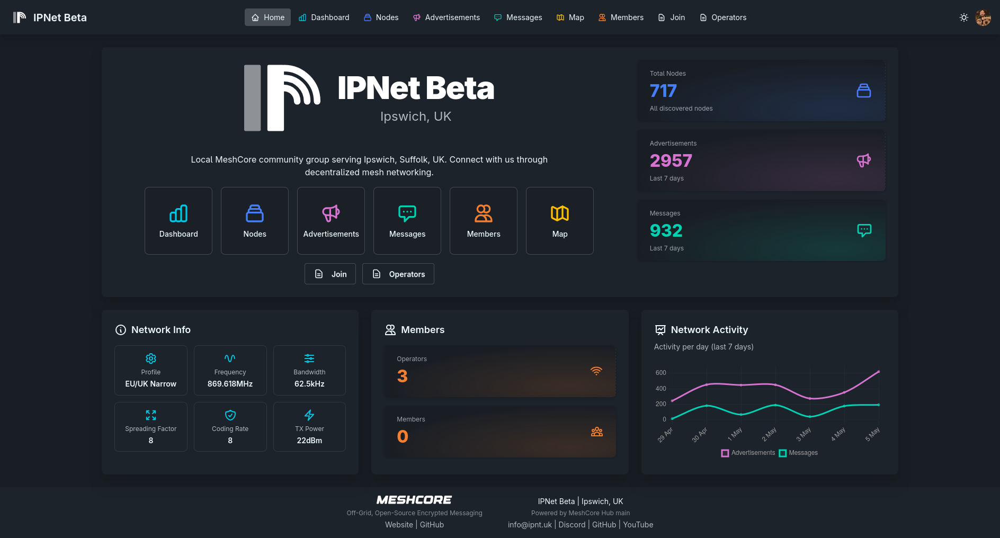
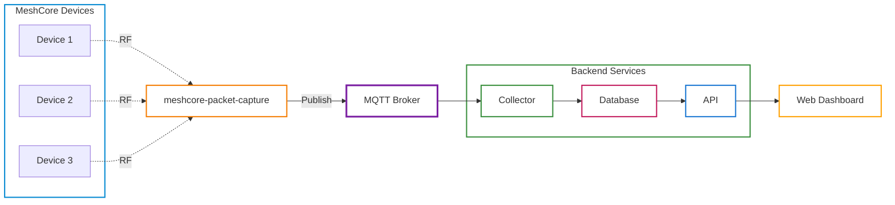

# MeshCore Hub

[](https://github.com/ipnet-mesh/meshcore-hub/actions/workflows/ci.yml)
[](https://github.com/ipnet-mesh/meshcore-hub/actions/workflows/docker.yml)
[](https://codecov.io/github/ipnet-mesh/meshcore-hub)
[](https://www.buymeacoffee.com/jinglemansweep)

Python 3.14+ platform for managing and orchestrating MeshCore mesh networks.

> [!WARNING]
> **BREAKING CHANGES** - The latest release replaces Mosquitto with a JWT-based MQTT broker, removes the proprietary receiver service in favor of [meshcore-packet-capture](https://github.com/agessaman/meshcore-packet-capture), and renames `receiver_node_id` to `observer_node_id` in the database. If upgrading from a previous version, see [docs/upgrading.md](docs/upgrading.md) for migration steps.



> [!IMPORTANT]
> **Help Translate MeshCore Hub** 🌍
>
> We need volunteers to translate the web dashboard! Currently only English is available. Check out the [Translation Guide](docs/i18n.md) to contribute a language pack. Partial translations welcome!

## Overview

MeshCore Hub provides a complete solution for monitoring, collecting, and interacting with MeshCore mesh networks. Data ingestion is handled by [meshcore-packet-capture](https://github.com/agessaman/meshcore-packet-capture), which observes MeshCore RF traffic and publishes decoded packets to MQTT. It consists of multiple components that work together:

| Component         | Description                                                  |
| ----------------- | ------------------------------------------------------------ |
| **Collector**     | Subscribes to MQTT events and persists them to a database    |
| **API**           | REST API for querying data                                   |
| **Web Dashboard** | Single Page Application (SPA) for visualizing network status |

## Architecture



## Features

- **Event Persistence**: Store messages, advertisements, telemetry, and trace data
- **REST API**: Query historical data with filtering and pagination
- **Node Tagging**: Add custom metadata to nodes for organization
- **Web Dashboard**: Visualize network status, node locations, and message history
- **Internationalization**: Full i18n support with composable translation patterns
- **Docker Ready**: Single image with all components, easy deployment

## Getting Started

### Docker Compose Profiles

Docker Compose uses **profiles** to select which services to run. The configuration is split across multiple files:

| File                         | Purpose                                                            |
| ---------------------------- | ------------------------------------------------------------------ |
| `docker-compose.yml`         | Base shared config (services, profiles, healthchecks, environment) |
| `docker-compose.dev.yml`     | Development overrides (port mappings for direct access)            |
| `docker-compose.prod.yml`    | Production overrides (external proxy network, no exposed ports)    |
| `docker-compose.traefik.yml` | Optional Traefik auto-discovery labels                             |

All `docker compose` commands require explicit file selection with `-f`:

```bash
# Development (default — exposes ports for local access)
docker compose -f docker-compose.yml -f docker-compose.dev.yml --profile all up -d

# Production (generic reverse proxy — nginx, caddy, etc.)
docker compose -f docker-compose.yml -f docker-compose.prod.yml --profile all up -d

# Production (Traefik)
docker compose -f docker-compose.yml -f docker-compose.prod.yml -f docker-compose.traefik.yml --profile all up -d
```

Service profiles:

| Profile    | Services                        | Use Case                                  |
| ---------- | ------------------------------- | ----------------------------------------- |
| `all`      | mqtt, observer, migrate, collector, api, web | Everything on one host        |
| `core`     | migrate, collector, api, web                 | Central server infrastructure |
| `mqtt`     | meshcore-mqtt-broker            | Local MQTT broker (optional)              |
| `observer` | packet capture observer         | Observes RF traffic and publishes to MQTT |
| `seed`     | seed                            | One-time seed data import                 |
| `migrate`  | migrate                         | One-time database migration               |

**Note:** Most deployments connect to an external MQTT broker. Add `--profile mqtt` only if you need a local broker. The `observer` profile runs [meshcore-packet-capture](https://github.com/agessaman/meshcore-packet-capture) to observe MeshCore RF traffic and publish decoded packets to MQTT.

### Simple Self-Hosted Setup

The quickest way to get started is running the entire stack on a single machine with a connected LoRa radio.

**Prerequisites:**

1. A compatible LoRa radio (e.g., Heltec V3, T-Beam) connected via serial

**Steps:**

```bash
# Create a directory, download the Docker Compose files, Makefile and
# example environment configuration file

mkdir meshcore-hub
cd meshcore-hub
wget https://raw.githubusercontent.com/ipnet-mesh/meshcore-hub/refs/heads/main/docker-compose.yml
wget https://raw.githubusercontent.com/ipnet-mesh/meshcore-hub/refs/heads/main/docker-compose.dev.yml
wget https://raw.githubusercontent.com/ipnet-mesh/meshcore-hub/refs/heads/main/Makefile
wget https://raw.githubusercontent.com/ipnet-mesh/meshcore-hub/refs/heads/main/.env.example

# Copy and configure environment
cp .env.example .env
# Edit .env: set PACKETCAPTURE_IATA to your 3-letter airport code
#            set SERIAL_PORT if not /dev/ttyUSB0

# Start the entire stack with local MQTT broker and packet capture
docker compose -f docker-compose.yml -f docker-compose.dev.yml --profile mqtt --profile core --profile observer up -d

# View the web dashboard
open http://localhost:8080
```

This starts all services: MQTT broker, collector, API, web dashboard, and packet capture. The `observer` profile runs [meshcore-packet-capture](https://github.com/agessaman/meshcore-packet-capture) to observe MeshCore RF traffic and publish decoded packets to MQTT.

> **ARM / Raspberry Pi:** The `observer` service Docker image (`ghcr.io/agessaman/meshcore-packet-capture`) does not currently support ARM architectures. A [PR is open](https://github.com/agessaman/meshcore-packet-capture/pull/13) on the upstream project to add ARM support but has not yet been merged. To run the observer on a Raspberry Pi, do not use the `--profile observer` Docker profile — instead, install [meshcore-packet-capture](https://github.com/agessaman/meshcore-packet-capture) natively on the Pi and configure it to publish to your MQTT broker.

## Deployment

### Production Setup

For production deployments, use `docker-compose.prod.yml` which connects services to an external proxy network. No ports are exposed directly — all traffic goes through your reverse proxy.

**Prerequisites:**

1. A reverse proxy (Nginx Proxy Manager, Caddy, Traefik, etc.)
2. Docker network for proxy communication

**Steps:**

```bash
# Create proxy network (once)
docker network create proxy-net

# Download compose files, Makefile and config
mkdir meshcore-hub && cd meshcore-hub
wget https://raw.githubusercontent.com/ipnet-mesh/meshcore-hub/refs/heads/main/docker-compose.yml
wget https://raw.githubusercontent.com/ipnet-mesh/meshcore-hub/refs/heads/main/docker-compose.prod.yml
wget https://raw.githubusercontent.com/ipnet-mesh/meshcore-hub/refs/heads/main/Makefile
wget https://raw.githubusercontent.com/ipnet-mesh/meshcore-hub/refs/heads/main/.env.example
cp .env.example .env
# Edit .env: set COMPOSE_PROJECT_NAME, MQTT credentials, API keys, etc.

# Start core services
docker compose -f docker-compose.yml -f docker-compose.prod.yml --profile core up -d

# Or include local MQTT broker
docker compose -f docker-compose.yml -f docker-compose.prod.yml --profile mqtt --profile core up -d

# Or include packet capture on the same host
docker compose -f docker-compose.yml -f docker-compose.prod.yml --profile mqtt --profile core --profile observer up -d
```

Configure your reverse proxy to forward to the containers:

| Service        | Container                     | Port | Path                             |
| -------------- | ----------------------------- | ---- | -------------------------------- |
| Web Dashboard  | `{COMPOSE_PROJECT_NAME}-web`  | 8080 | `/`                              |
| API            | `{COMPOSE_PROJECT_NAME}-api`  | 8000 | `/api`, `/metrics`, `/health`    |
| MQTT WebSocket | `{COMPOSE_PROJECT_NAME}-mqtt` | 1883 | `/` (only if using local broker) |

> **Important:** Do not host under a subpath (e.g., `/meshcore`). Proxy at `/`.

#### Reverse Proxy

MeshCore Hub is designed to run behind a reverse proxy in production. Guides for specific reverse proxies:

- [Nginx Proxy Manager](docs/hosting/nginx-proxy-manager.md) — Admin authentication setup with dual hostnames

A Traefik override file is also provided with pre-configured labels:

```bash
# Download the Traefik override
wget https://raw.githubusercontent.com/ipnet-mesh/meshcore-hub/refs/heads/main/docker-compose.traefik.yml

# Set your domain in .env
echo "TRAEFIK_DOMAIN=meshcore.example.com" >> .env

# Start with Traefik labels
docker compose -f docker-compose.yml -f docker-compose.prod.yml -f docker-compose.traefik.yml --profile core up -d
```

This routes the web dashboard and API to `TRAEFIK_DOMAIN` with automatic TLS.

### Adding Remote Observers

Other operators can run their own [meshcore-packet-capture](https://github.com/agessaman/meshcore-packet-capture) instance and publish decoded packets to your MeshCore Hub. They can also optionally contribute to the LetsMesh network.

> **Prerequisite:** Your MQTT broker must be accessible to remote observers. In production, this means exposing the WebSocket listener via a reverse proxy with TLS (e.g., `wss://mqtt.example.com/mqtt`).

#### Example: Observer contributing to LetsMesh and your community Hub

```bash
# In the observer's .env or docker-compose environment:

# Server 1 - Let's Mesh US (opt-in)
PACKETCAPTURE_MQTT1_ENABLED=true
PACKETCAPTURE_MQTT1_SERVER=mqtt-us-v1.letsmesh.net
PACKETCAPTURE_MQTT1_PORT=443
PACKETCAPTURE_MQTT1_TRANSPORT=websockets
PACKETCAPTURE_MQTT1_USE_TLS=true
PACKETCAPTURE_MQTT1_USE_AUTH_TOKEN=true
PACKETCAPTURE_MQTT1_TOKEN_AUDIENCE=mqtt-us-v1.letsmesh.net

# Server 2 - Let's Mesh EU (opt-in)
PACKETCAPTURE_MQTT2_ENABLED=false

# Server 3 - Your MeshCore Hub
PACKETCAPTURE_MQTT3_ENABLED=true
PACKETCAPTURE_MQTT3_SERVER=mqtt.example.com
PACKETCAPTURE_MQTT3_PORT=443
PACKETCAPTURE_MQTT3_TRANSPORT=websockets
PACKETCAPTURE_MQTT3_USE_TLS=true
PACKETCAPTURE_MQTT3_USE_AUTH_TOKEN=true
PACKETCAPTURE_MQTT3_TOKEN_AUDIENCE=mqtt.example.com
```

Replace `mqtt.example.com` with your public MQTT domain. The `TOKEN_AUDIENCE` must match the `MQTT_TOKEN_AUDIENCE` or `AUTH_EXPECTED_AUDIENCE` configured on your broker.

For local network observers (no TLS):

```bash
PACKETCAPTURE_MQTT3_SERVER=192.168.1.100
PACKETCAPTURE_MQTT3_PORT=1883
PACKETCAPTURE_MQTT3_TRANSPORT=websockets
PACKETCAPTURE_MQTT3_USE_TLS=false
PACKETCAPTURE_MQTT3_TOKEN_AUDIENCE=mqtt.localhost
```

### Backup & Restore

#### Using Makefile

```bash
# Back up all volumes to backup/
make backup

# Restore a specific volume
make restore FILE=backup/hub_data-20260414-120000.tar.gz
```

#### Using shell commands

```bash
# Back up the database volume
source .env 2>/dev/null || true
mkdir -p backup
vol=${COMPOSE_PROJECT_NAME:-hub}_data
docker run --rm -v $vol:/data -v $(pwd)/backup:/backup \
  alpine tar czf /backup/$vol-$(date +%Y%m%d-%H%M%S).tar.gz -C / data

# Restore a specific volume (volume name derived from tarball filename)
source .env 2>/dev/null || true
FILE=backup/${COMPOSE_PROJECT_NAME:-hub}_data-20260414-120000.tar.gz
vol=$(basename "$FILE" | sed 's/-[0-9]\{8\}-[0-9]\{6\}\.tar\.gz//')
docker run --rm -v $vol:/data -v $(pwd)/backup:/backup \
  alpine sh -c "cd / && tar xzf /backup/$(basename $FILE)"
```

> **Note:** Replace `hub` with your `COMPOSE_PROJECT_NAME` if using a different instance name. Monitoring infrastructure (Prometheus, Alertmanager) manages its own data — consult your monitoring stack's documentation for backup procedures.

## Configuration

All components are configured via environment variables. Create a `.env` file or export variables:

### Common Settings

| Variable         | Default      | Description                                                 |
| ---------------- | ------------ | ----------------------------------------------------------- |
| `LOG_LEVEL`      | `INFO`       | Logging level (DEBUG, INFO, WARNING, ERROR)                 |
| `DATA_HOME`      | `./data`     | Base directory for runtime data                             |
| `SEED_HOME`      | `./seed`     | Directory containing seed data files                        |
| `MQTT_HOST`      | `localhost`  | MQTT broker hostname                                        |
| `MQTT_PORT`      | `1883`       | MQTT broker port                                            |
| `MQTT_USERNAME`  | _(none)_     | MQTT username (optional)                                    |
| `MQTT_PASSWORD`  | _(none)_     | MQTT password (optional)                                    |
| `MQTT_PREFIX`    | `meshcore`   | Topic prefix for all MQTT messages                          |
| `MQTT_TLS`       | `false`      | Enable TLS/SSL for MQTT connection                          |
| `MQTT_TRANSPORT` | `websockets` | MQTT transport (`tcp` or `websockets`)                      |
| `MQTT_WS_PATH`   | `/`          | MQTT WebSocket path (used when `MQTT_TRANSPORT=websockets`) |

### Collector Settings

| Variable                         | Default  | Description                                                          |
| -------------------------------- | -------- | -------------------------------------------------------------------- |
| `COLLECTOR_CHANNEL_KEYS`         | _(none)_ | Additional decoder channel keys (`label=hex`, `label:hex`, or `hex`) |
| `COLLECTOR_INCLUDE_TEST_CHANNEL` | `false`  | Include built-in 'test' channel messages                             |

#### LetsMesh Packet Decoding

For details on how the collector normalizes and decodes LetsMesh packets, see [docs/letsmesh.md](docs/letsmesh.md).

### Webhooks

The collector can forward events (advertisements, messages) to external HTTP endpoints via webhooks with configurable URLs, secrets, retries, and timeouts. See [docs/webhooks.md](docs/webhooks.md) for the full configuration reference and payload format.

### Data Retention

The collector automatically cleans up old event data and inactive nodes:

| Variable                        | Default | Description                              |
| ------------------------------- | ------- | ---------------------------------------- |
| `DATA_RETENTION_ENABLED`        | `true`  | Enable automatic cleanup of old events   |
| `DATA_RETENTION_DAYS`           | `30`    | Days to retain event data                |
| `DATA_RETENTION_INTERVAL_HOURS` | `24`    | Hours between cleanup runs               |
| `NODE_CLEANUP_ENABLED`          | `true`  | Enable removal of inactive nodes         |
| `NODE_CLEANUP_DAYS`             | `7`     | Remove nodes not seen for this many days |

### API Settings

| Variable            | Default   | Description                                             |
| ------------------- | --------- | ------------------------------------------------------- |
| `API_HOST`          | `0.0.0.0` | API bind address                                        |
| `API_PORT`          | `8000`    | API port                                                |
| `API_READ_KEY`      | _(none)_  | Read-only API key                                       |
| `API_ADMIN_KEY`     | _(none)_  | Admin API key                                           |
| `METRICS_ENABLED`   | `true`    | Enable Prometheus metrics endpoint at `/metrics`        |
| `METRICS_CACHE_TTL` | `60`      | Seconds to cache metrics output (reduces database load) |

### Web Dashboard Settings

| Variable                   | Default                 | Description                                                                                                                                                                                                                                  |
| -------------------------- | ----------------------- | -------------------------------------------------------------------------------------------------------------------------------------------------------------------------------------------------------------------------------------------- |
| `WEB_HOST`                 | `0.0.0.0`               | Web server bind address                                                                                                                                                                                                                      |
| `WEB_PORT`                 | `8080`                  | Web server port                                                                                                                                                                                                                              |
| `API_BASE_URL`             | `http://localhost:8000` | API endpoint URL                                                                                                                                                                                                                             |
| `API_KEY`                  | _(none)_                | API key for web dashboard queries (optional)                                                                                                                                                                                                 |
| `WEB_THEME`                | `dark`                  | Default theme (`dark` or `light`). Users can override via theme toggle in navbar.                                                                                                                                                            |
| `WEB_LOCALE`               | `en`                    | Locale/language for the web dashboard (e.g., `en`, `es`, `fr`)                                                                                                                                                                               |
| `WEB_DATETIME_LOCALE`      | `en-US`                 | Locale used for date formatting in the web dashboard (e.g., `en-US` for MM/DD/YYYY, `en-GB` for DD/MM/YYYY).                                                                                                                                 |
| `WEB_AUTO_REFRESH_SECONDS` | `30`                    | Auto-refresh interval in seconds for list pages (0 to disable)                                                                                                                                                                               |
| `WEB_ADMIN_ENABLED`        | `false`                 | Enable admin interface at /a/ (requires auth proxy: `X-Forwarded-User`/`X-Auth-Request-User` or forwarded `Authorization: Basic ...`)                                                                                                        |
| `WEB_TRUSTED_PROXY_HOSTS`  | `*`                     | Comma-separated list of trusted proxy hosts for admin authentication headers. Default: `*` (all hosts). Recommended: set to your reverse proxy IP in production. A startup warning is emitted when using the default `*` with admin enabled. |
| `TZ`                       | `UTC`                   | Timezone for displaying dates/times (e.g., `America/New_York`, `Europe/London`)                                                                                                                                                              |
| `NETWORK_DOMAIN`           | _(none)_                | Network domain name (optional)                                                                                                                                                                                                               |
| `NETWORK_NAME`             | `MeshCore Network`      | Display name for the network                                                                                                                                                                                                                 |
| `NETWORK_CITY`             | _(none)_                | City where network is located                                                                                                                                                                                                                |
| `NETWORK_COUNTRY`          | _(none)_                | Country code (ISO 3166-1 alpha-2)                                                                                                                                                                                                            |
| `NETWORK_RADIO_CONFIG`     | _(none)_                | Radio config (comma-delimited: profile,freq,bw,sf,cr,power)                                                                                                                                                                                  |
| `NETWORK_WELCOME_TEXT`     | _(none)_                | Custom welcome text for homepage                                                                                                                                                                                                             |
| `NETWORK_CONTACT_EMAIL`    | _(none)_                | Contact email address                                                                                                                                                                                                                        |
| `NETWORK_CONTACT_DISCORD`  | _(none)_                | Discord server link                                                                                                                                                                                                                          |
| `NETWORK_CONTACT_GITHUB`   | _(none)_                | GitHub repository URL                                                                                                                                                                                                                        |
| `NETWORK_CONTACT_YOUTUBE`  | _(none)_                | YouTube channel URL                                                                                                                                                                                                                          |
| `CONTENT_HOME`             | `./content`             | Directory containing custom content (pages/, media/)                                                                                                                                                                                         |

Timezone handling note:

- API timestamps that omit an explicit timezone suffix are treated as UTC before rendering in the configured `TZ`.

### Feature Flags

Control which pages are visible in the web dashboard. Disabled features are fully hidden: removed from navigation, return 404 on their routes, and excluded from sitemap/robots.txt.

| Variable                 | Default | Description                                           |
| ------------------------ | ------- | ----------------------------------------------------- |
| `FEATURE_DASHBOARD`      | `true`  | Enable the `/dashboard` page                          |
| `FEATURE_NODES`          | `true`  | Enable the `/nodes` pages (list, detail, short links) |
| `FEATURE_ADVERTISEMENTS` | `true`  | Enable the `/advertisements` page                     |
| `FEATURE_MESSAGES`       | `true`  | Enable the `/messages` page                           |
| `FEATURE_MAP`            | `true`  | Enable the `/map` page and `/map/data` endpoint       |
| `FEATURE_MEMBERS`        | `true`  | Enable the `/members` page                            |
| `FEATURE_PAGES`          | `true`  | Enable custom markdown pages                          |

**Dependencies:** Dashboard auto-disables when all of Nodes/Advertisements/Messages are disabled. Map auto-disables when Nodes is disabled.

## Custom Content

The web dashboard supports custom markdown pages and media files (including custom logos) served from a configurable content directory. See [docs/content.md](docs/content.md) for the full setup guide including directory structure, frontmatter fields, and Docker volume mounting.

## Seed Data

The database can be seeded with node tags and network members from YAML files. See [docs/seeding.md](docs/seeding.md) for format details, directory structure, and running the seed process.

## API Documentation

When running, the API provides interactive documentation at:

- **Swagger UI**: http://localhost:8000/api/docs
- **ReDoc**: http://localhost:8000/api/redoc
- **OpenAPI JSON**: http://localhost:8000/api/openapi.json

Health check endpoints are also available:

- **Health**: http://localhost:8000/health
- **Ready**: http://localhost:8000/health/ready (includes database check)
- **Metrics**: http://localhost:8000/metrics (Prometheus format — point your Prometheus scraper here)

### Authentication

The API supports optional bearer token authentication:

```bash
# Read-only access
curl -H "Authorization: Bearer <API_READ_KEY>" http://localhost:8000/api/v1/nodes

# Admin access
curl -H "Authorization: Bearer <API_ADMIN_KEY>" http://localhost:8000/api/v1/members
```

### Example Endpoints

| Method | Endpoint                             | Description                       |
| ------ | ------------------------------------ | --------------------------------- |
| GET    | `/api/v1/nodes`                      | List all known nodes              |
| GET    | `/api/v1/nodes/{public_key}`         | Get node details                  |
| GET    | `/api/v1/nodes/prefix/{prefix}`      | Get node by public key prefix     |
| GET    | `/api/v1/nodes/{public_key}/tags`    | Get node tags                     |
| POST   | `/api/v1/nodes/{public_key}/tags`    | Create node tag                   |
| GET    | `/api/v1/messages`                   | List messages with filters        |
| GET    | `/api/v1/advertisements`             | List advertisements               |
| GET    | `/api/v1/telemetry`                  | List telemetry data               |
| GET    | `/api/v1/trace-paths`                | List trace paths                  |
| GET    | `/api/v1/members`                    | List network members              |
| GET    | `/api/v1/dashboard/stats`            | Get network statistics            |
| GET    | `/api/v1/dashboard/activity`         | Get daily advertisement activity  |
| GET    | `/api/v1/dashboard/message-activity` | Get daily message activity        |
| GET    | `/api/v1/dashboard/node-count`       | Get cumulative node count history |

## Development

### Setup

```bash
# Clone and setup
git clone https://github.com/ipnet-mesh/meshcore-hub.git
cd meshcore-hub
python -m venv .venv
source .venv/bin/activate
pip install -e ".[dev]"

# Install pre-commit hooks
pre-commit install

# Run database migrations
meshcore-hub db upgrade

# Start components (in separate terminals)
meshcore-hub collector
meshcore-hub api
meshcore-hub web
```

### Running Tests

```bash
# Run all tests
pytest

# Run with coverage
pytest --cov=meshcore_hub --cov-report=html

# Run specific test file
pytest tests/test_api/test_nodes.py

# Run tests matching pattern
pytest -k "test_list"
```

### Code Quality

```bash
# Run all code quality checks (formatting, linting, type checking)
pre-commit run --all-files
```

### Creating Database Migrations

```bash
# Auto-generate migration from model changes
meshcore-hub db revision --autogenerate -m "Add new field to nodes"

# Create empty migration
meshcore-hub db revision -m "Custom migration"

# Apply migrations
meshcore-hub db upgrade
```

## Project Structure

```
meshcore-hub/
├── src/meshcore_hub/       # Main package
│   ├── common/             # Shared code (models, schemas, config)
│   ├── collector/          # MQTT event collector
│   ├── api/                # REST API
│   └── web/                # Web dashboard
│       ├── templates/      # Jinja2 templates (SPA shell)
│       └── static/
│           ├── js/spa/     # SPA frontend (ES modules, lit-html)
│           └── locales/    # Translation files (en.json)
├── tests/                  # Test suite
├── alembic/                # Database migrations
├── etc/                    # Configuration files (MQTT, Prometheus, Alertmanager)
├── example/                # Example files for reference
│   ├── seed/               # Example seed data files
│   │   ├── node_tags.yaml  # Example node tags
│   │   └── members.yaml    # Example network members
│   └── content/            # Example custom content
│       ├── pages/          # Example custom pages
│       │   └── join.md     # Example join page
│       └── media/          # Example media files
│           └── images/     # Custom images
├── seed/                   # Seed data directory (SEED_HOME, copy from example/seed/)
├── content/                # Custom content directory (CONTENT_HOME, optional)
│   ├── pages/              # Custom markdown pages
│   └── media/              # Custom media files
│       └── images/         # Custom images (logo.svg/png/jpg/jpeg/webp replace default logo)
├── data/                   # Runtime data directory (DATA_HOME, created at runtime)
├── Dockerfile              # Docker build configuration
├── docker-compose.yml      # Docker Compose base config
├── docker-compose.dev.yml  # Development overrides (port mappings)
├── docker-compose.prod.yml # Production overrides (proxy network)
├── docker-compose.traefik.yml # Optional Traefik labels
├── docs/                    # Documentation
│   ├── images/              # Screenshots and images
│   ├── hosting/             # Reverse proxy hosting guides
│   │   └── nginx-proxy-manager.md
│   ├── content.md           # Custom content setup guide
│   ├── i18n.md              # Translation reference guide
│   ├── letsmesh.md          # LetsMesh packet decoding details
│   ├── seeding.md           # Seed data format and import guide
│   ├── upgrading.md         # Upgrade guide for breaking changes
│   └── webhooks.md          # Webhook configuration reference
├── SCHEMAS.md               # Event schema documentation
└── AGENTS.md                # AI assistant guidelines
```

## Documentation

- [SCHEMAS.md](SCHEMAS.md) - MeshCore event schemas
- [docs/upgrading.md](docs/upgrading.md) - Upgrade guide for breaking changes
- [docs/letsmesh.md](docs/letsmesh.md) - LetsMesh packet decoding details
- [docs/seeding.md](docs/seeding.md) - Seed data format and import guide
- [docs/content.md](docs/content.md) - Custom content setup guide
- [docs/hosting/nginx-proxy-manager.md](docs/hosting/nginx-proxy-manager.md) - Nginx Proxy Manager admin setup
- [docs/i18n.md](docs/i18n.md) - Translation reference guide
- [AGENTS.md](AGENTS.md) - Guidelines for AI coding assistants

## Contributing

1. Fork the repository
2. Create a feature branch (`git checkout -b feature/amazing-feature`)
3. Make your changes
4. Run tests and quality checks (`pytest && pre-commit run --all-files`)
5. Commit your changes (`git commit -m 'Add amazing feature'`)
6. Push to the branch (`git push origin feature/amazing-feature`)
7. Open a Pull Request

## License

This project is licensed under the GNU General Public License v3.0 or later (GPL-3.0-or-later). See [LICENSE](LICENSE) for details.

## Acknowledgments

- [MeshCore](https://meshcore.dev/) - The mesh networking protocol
- [meshcore](https://github.com/fdlamotte/meshcore) - Python library for MeshCore devices
- [meshcore-packet-capture](https://github.com/agessaman/meshcore-packet-capture) - RF packet capture and MQTT publisher for data ingestion
- [meshcore-mqtt-broker](https://github.com/michaelhart/meshcore-mqtt-broker) - WebSocket MQTT broker with MeshCore public key authentication. The Docker image (`ghcr.io/ipnet-mesh/meshcore-mqtt-broker`) is built and published by a GitHub Action in this repository that clones the upstream source, as the upstream project does not currently provide a public Docker image (although a [PR has been submitted](https://github.com/michaelhart/meshcore-mqtt-broker/pull/1) to add this).
