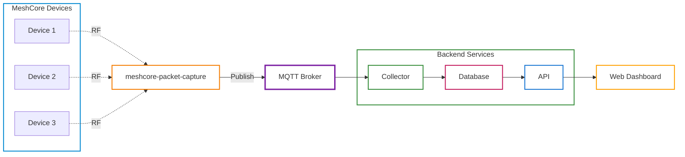

# MeshCore Hub

[](https://github.com/ipnet-mesh/meshcore-hub/actions/workflows/ci.yml)
[](https://github.com/ipnet-mesh/meshcore-hub/actions/workflows/docker.yml)
[](https://codecov.io/github/ipnet-mesh/meshcore-hub)
[](https://www.buymeacoffee.com/jinglemansweep)

Python 3.14+ platform for managing and orchestrating MeshCore mesh networks.

> [!WARNING]
> **DEPRECATION NOTICE** — v0.14 adds PostgreSQL support (`DATABASE_BACKEND=postgres`); SQLite remains the zero-config default. SQLite support will be maintained for at least the next few releases (~3 months), then removed in favour of PostgreSQL-only. See [docs/database.md](docs/database.md) to switch backends and [docs/upgrading.md](docs/upgrading.md) to migrate.


## Overview

MeshCore Hub provides a complete solution for monitoring, collecting, and interacting with MeshCore mesh networks. Data ingestion is handled by [meshcore-packet-capture](https://github.com/agessaman/meshcore-packet-capture), which observes MeshCore RF traffic and publishes decoded packets to MQTT. It consists of multiple components that work together:

| Component         | Description                                                  |
| ----------------- | ------------------------------------------------------------ |
| **Collector**     | Subscribes to MQTT events and persists them to a database    |
| **API**           | REST API for querying data                                   |
| **Web Dashboard** | Single Page Application (SPA) for visualizing network status |

## MeshCore Hub Networks

Local mesh communities that are using MeshCore Hub:

- [IPNet (Ipswich, UK)](https://ipnt.uk/)
- [CumbriaCQ MeshCore (Cumbria, UK)](https://meshcore.cumbriacq.com/)
- [Skynet (Wales, UK)](https://skynet.cyberdyne-systems.wales/)
- [MeshCore Iasi (Romania)](https://meshcore-iasi.ro/)

## Architecture



## Features

- **Event Persistence**: Store messages, advertisements, telemetry, and trace data
- **Raw Packet Inspection**: Capture, browse, and search raw wire packets; a deduplicated packet view shows every observer reception and routing path, with clickable path-hash badges that look up the matching nodes
- **REST API**: Query historical data with filtering and pagination
- **Node Tagging**: Add custom metadata to nodes for organization
- **Web Dashboard**: Visualize network status, node locations, and message history
- **Internationalization**: Full i18n support with composable translation patterns
- **Docker Ready**: Single image with all components, easy deployment

## Getting Started

### Docker Compose Profiles

Docker Compose uses **profiles** to select which services to run. The configuration is split across multiple files:

| File                         | Purpose                                                            |
| ---------------------------- | ------------------------------------------------------------------ |
| `docker-compose.yml`         | Base shared config (services, profiles, healthchecks, environment) |
| `docker-compose.dev.yml`     | Development overrides (port mappings for direct access)            |
| `docker-compose.prod.yml`    | Production overrides (external proxy network, no exposed ports)    |
| `docker-compose.traefik.yml` | Optional Traefik auto-discovery labels                             |

All `docker compose` commands require explicit file selection with `-f`:

```bash
# Development (default — exposes ports for local access)
docker compose -f docker-compose.yml -f docker-compose.dev.yml --profile all up -d

# Production (generic reverse proxy — nginx, caddy, etc.)
docker compose -f docker-compose.yml -f docker-compose.prod.yml --profile all up -d

# Production (Traefik)
docker compose -f docker-compose.yml -f docker-compose.prod.yml -f docker-compose.traefik.yml --profile all up -d
```

Service profiles:

| Profile    | Services                        | Use Case                                  |
| ---------- | ------------------------------- | ----------------------------------------- |
| `all`      | mqtt, observer, migrate, collector, api, web | Everything on one host        |
| `core`     | migrate, collector, api, web                 | Central server infrastructure |
| `mqtt`     | meshcore-mqtt-broker            | Local MQTT broker (optional)              |
| `observer` | packet capture observer         | Observes RF traffic and publishes to MQTT |
| `seed`     | seed                            | One-time seed data import                 |
| `migrate`  | migrate                         | One-time database migration               |

**Note:** Most deployments connect to an external MQTT broker. Add `--profile mqtt` only if you need a local broker. The `observer` profile runs [meshcore-packet-capture](https://github.com/agessaman/meshcore-packet-capture) to observe MeshCore RF traffic and publish decoded packets to MQTT.

### Simple Self-Hosted Setup

The quickest way to get started is running the entire stack on a single machine with a connected LoRa radio.

**Prerequisites:**

1. A compatible LoRa radio (e.g., Heltec V3, T-Beam) connected via serial

**Steps:**

```bash
# Create a directory, download the Docker Compose files and
# example environment configuration file

mkdir meshcore-hub
cd meshcore-hub
wget https://raw.githubusercontent.com/ipnet-mesh/meshcore-hub/refs/heads/main/docker-compose.yml
wget https://raw.githubusercontent.com/ipnet-mesh/meshcore-hub/refs/heads/main/docker-compose.dev.yml
wget https://raw.githubusercontent.com/ipnet-mesh/meshcore-hub/refs/heads/main/.env.example

# Copy and configure environment
cp .env.example .env
# Edit .env: set PACKETCAPTURE_IATA to your 3-letter airport code
#            set SERIAL_PORT if not /dev/ttyUSB0

# Start the entire stack with local MQTT broker and packet capture
docker compose -f docker-compose.yml -f docker-compose.dev.yml --profile mqtt --profile core --profile observer up -d

# View the web dashboard
open http://localhost:8080
```

This starts all services: MQTT broker, collector, API, web dashboard, and packet capture. The `observer` profile runs [meshcore-packet-capture](https://github.com/agessaman/meshcore-packet-capture) to observe MeshCore RF traffic and publish decoded packets to MQTT.

## Deployment

For production deployments (reverse-proxy setup, Traefik overrides, multi-instance routing on a shared Docker host, and API scaling with `API_WORKERS`), see [docs/deployment.md](docs/deployment.md).

### Adding Remote Observers

Other operators can run their own [meshcore-packet-capture](https://github.com/agessaman/meshcore-packet-capture) instance and publish decoded packets to your MeshCore Hub, with optional contribution to the LetsMesh and MeshRank networks. For the ready-made Docker Compose setup and the `PACKETCAPTURE_*` configuration reference, see [docs/observer.md](docs/observer.md).

### Backup & Restore

For backing up and restoring Docker volumes (Makefile and shell variants), see [docs/maintenance.md](docs/maintenance.md).

## Configuration

All components are configured via environment variables. Copy `.env.example` to `.env` and override what you need. The full variable reference — grouped by feature (Common, Database, Caching, Collector, Webhooks, Auth, Data Retention, API, Web Dashboard, Feature Flags, Traefik, Prometheus & Alertmanager) — lives in [docs/configuration.md](docs/configuration.md); each section there links to the relevant feature doc for setup and operational details.

## Seed Data

The database can be seeded with node tags from YAML files. See [docs/seeding.md](docs/seeding.md) for format details, directory structure, and running the seed process.

## API Documentation

When running, the API provides interactive documentation at:

- **Swagger UI**: http://localhost:8000/api/docs
- **ReDoc**: http://localhost:8000/api/redoc
- **OpenAPI JSON**: http://localhost:8000/api/openapi.json

Health check endpoints are also available:

- **Health**: http://localhost:8000/health
- **Ready**: http://localhost:8000/health/ready (includes database check)
- **Metrics**: http://localhost:8000/metrics (Prometheus format — point your Prometheus scraper here)

### Authentication

The API supports optional bearer token authentication:

```bash
# Read-only access
curl -H "Authorization: Bearer <API_READ_KEY>" http://localhost:8000/api/v1/nodes

# Admin access
curl -H "Authorization: Bearer <API_ADMIN_KEY>" http://localhost:8000/api/v1/members
```

The web dashboard supports OIDC/OAuth2 authentication for admin access. When enabled, users must authenticate with an identity provider and have the `admin` role assigned. See [docs/auth.md](docs/auth.md) for setup instructions and IdP-specific guides.

### Example Endpoints

| Method | Endpoint                             | Description                       |
| ------ | ------------------------------------ | --------------------------------- |
| GET    | `/api/v1/nodes`                      | List all known nodes              |
| GET    | `/api/v1/nodes/{public_key}`         | Get node details                  |
| GET    | `/api/v1/nodes/prefix/{prefix}`      | Get node by public key prefix     |
| GET    | `/api/v1/nodes/{public_key}/tags`    | Get node tags                     |
| POST   | `/api/v1/nodes/{public_key}/tags`    | Create node tag                   |
| GET    | `/api/v1/messages`                   | List messages with filters        |
| GET    | `/api/v1/advertisements`             | List advertisements               |
| GET    | `/api/v1/telemetry`                  | List telemetry data               |
| GET    | `/api/v1/trace-paths`                | List trace paths                  |
| GET    | `/api/v1/members`                    | List network members              |
| GET    | `/api/v1/dashboard/stats`            | Get network statistics            |
| GET    | `/api/v1/dashboard/activity`         | Get daily advertisement activity  |
| GET    | `/api/v1/dashboard/message-activity` | Get daily message activity        |
| GET    | `/api/v1/dashboard/node-count`       | Get cumulative node count history |

## Development

### Setup

```bash
# Clone and setup
git clone https://github.com/ipnet-mesh/meshcore-hub.git
cd meshcore-hub

# Install frontend dependencies and build static assets (requires Node.js 22+ LTS)
npm install
npm run build

# Setup Python environment
python -m venv .venv
source .venv/bin/activate
pip install -e ".[dev]"

# Install pre-commit hooks
pre-commit install

# Run database migrations
meshcore-hub db upgrade

# Start components (in separate terminals)
meshcore-hub collector
meshcore-hub api
meshcore-hub web
```

> **Note:** `npm run build` compiles Tailwind CSS and copies vendor libraries (lit-html, Leaflet, Chart.js, QRCode.js) into `src/meshcore_hub/web/static/vendor/`. This step is required before the web dashboard will render correctly. In Docker, this happens automatically during the build.

### Running Tests

```bash
# Run all tests
pytest

# Run with coverage
pytest --cov=meshcore_hub --cov-report=html

# Run specific test file
pytest tests/test_api/test_nodes.py

# Run tests matching pattern
pytest -k "test_list"
```

### Code Quality

```bash
# Run all code quality checks (formatting, linting, type checking)
pre-commit run --all-files
```

### Creating Database Migrations

```bash
# Auto-generate migration from model changes
meshcore-hub db revision --autogenerate -m "Add new field to nodes"

# Create empty migration
meshcore-hub db revision -m "Custom migration"

# Apply migrations
meshcore-hub db upgrade
```

## Project Structure

```
meshcore-hub/
├── src/meshcore_hub/       # Main package
│   ├── common/             # Shared code (models, schemas, config)
│   ├── collector/          # MQTT event collector
│   ├── api/                # REST API
│   └── web/                # Web dashboard
│       ├── templates/      # Jinja2 templates (SPA shell)
│       └── static/
│           ├── css/         # Stylesheets (app.css, input.css, built tailwind.css)
│           ├── vendor/      # Vendored JS/CSS libraries (built by npm run build)
│           ├── js/spa/      # SPA frontend (ES modules, lit-html)
│           └── locales/     # Translation files (en.json)
├── tests/                  # Test suite
├── alembic/                # Database migrations
├── etc/                    # Configuration files (MQTT, Prometheus, Alertmanager)
├── example/                # Example files for reference
│   ├── seed/               # Example seed data files
│   │   └── node_tags.yaml  # Example node tags
│   └── content/            # Example custom content
│       ├── pages/          # Example custom pages
│       │   └── join.md     # Example join page
│       └── media/          # Example media files
│           └── images/     # Custom images
├── seed/                   # Seed data directory (SEED_HOME, copy from example/seed/)
├── content/                # Custom content directory (CONTENT_HOME, optional)
│   ├── pages/              # Custom markdown pages
│   └── media/              # Custom media files
│       └── images/         # Custom images (logo.svg/png/jpg/jpeg/webp replace default logo)
├── data/                   # Runtime data directory (DATA_HOME, created at runtime)
├── Dockerfile              # Docker build configuration (multi-stage: Node.js frontend + Python)
├── package.json            # Frontend build dependencies (Tailwind, DaisyUI, lit-html, etc.)
├── build.js                # Frontend build script (Tailwind CLI + vendor copy)
├── docker-compose.yml      # Docker Compose base config
├── docker-compose.dev.yml  # Development overrides (port mappings)
├── docker-compose.prod.yml # Production overrides (proxy network)
├── docker-compose.traefik.yml # Optional Traefik labels
├── docs/                    # Documentation
│   ├── images/              # Screenshots and images
│   ├── hosting/             # Reverse proxy hosting guides
│   ├── configuration.md     # Single source of truth for environment variables
│   ├── content.md           # Custom content setup guide
│   ├── database.md          # Database backends (SQLite/PostgreSQL) reference
│   ├── deployment.md        # Production setup, scaling, Redis, multi-instance
│   ├── i18n.md              # Translation reference guide
│   ├── letsmesh.md          # LetsMesh packet decoding details
│   ├── maintenance.md       # Backup and restore procedures
│   ├── observer.md          # Remote observers and PACKETCAPTURE_* reference
│   ├── seeding.md           # Seed data format and import guide
│   ├── upgrading.md         # Upgrade guide for breaking changes
│   └── webhooks.md          # Webhook configuration reference
├── SCHEMAS.md               # Event schema documentation
└── AGENTS.md                # AI assistant guidelines
```

## Documentation

- [SCHEMAS.md](SCHEMAS.md) - MeshCore event schemas
- [docs/configuration.md](docs/configuration.md) - Single source of truth for environment variables
- [docs/deployment.md](docs/deployment.md) - Production setup, reverse proxy, multi-instance, API scaling, Redis
- [docs/observer.md](docs/observer.md) - Remote packet-capture observers and `PACKETCAPTURE_*` reference
- [docs/maintenance.md](docs/maintenance.md) - Backup and restore procedures
- [docs/database.md](docs/database.md) - Database backends (SQLite/PostgreSQL) and migration
- [docs/upgrading.md](docs/upgrading.md) - Upgrade guide for breaking changes
- [docs/letsmesh.md](docs/letsmesh.md) - LetsMesh packet decoding details
- [docs/seeding.md](docs/seeding.md) - Seed data format and import guide
- [docs/i18n.md](docs/i18n.md) - Translation reference guide
- [docs/content.md](docs/content.md) - Custom content setup guide
- [docs/auth.md](docs/auth.md) - OIDC authentication setup and configuration
- [docs/webhooks.md](docs/webhooks.md) - Webhook configuration reference
- [AGENTS.md](AGENTS.md) - Guidelines for AI coding assistants

## Contributing

1. Fork the repository
2. Create a feature branch (`git checkout -b feature/amazing-feature`)
3. Make your changes
4. Run tests and quality checks (`pytest && pre-commit run --all-files`)
5. Commit your changes (`git commit -m 'Add amazing feature'`)
6. Push to the branch (`git push origin feature/amazing-feature`)
7. Open a Pull Request

> [!IMPORTANT]
> **Help Translate MeshCore Hub** 🌍
>
> We need volunteers to translate the web dashboard! Currently only English is available. Check out the [Translation Guide](docs/i18n.md) to contribute a language pack. Partial translations welcome!

## License

This project is licensed under the GNU General Public License v3.0 or later (GPL-3.0-or-later). See [LICENSE](LICENSE) for details.

## Acknowledgments

- [MeshCore](https://meshcore.io/) - The mesh networking protocol
- [meshcore](https://github.com/fdlamotte/meshcore) - Python library for MeshCore devices
- [meshcore-packet-capture](https://github.com/agessaman/meshcore-packet-capture) - RF packet capture and MQTT publisher for data ingestion
- [meshcore-mqtt-broker](https://github.com/michaelhart/meshcore-mqtt-broker) - WebSocket MQTT broker with MeshCore public key authentication. The Docker image (`ghcr.io/ipnet-mesh/meshcore-mqtt-broker`) is built and published by a GitHub Action in this repository that clones the upstream source, as the upstream project does not currently provide a public Docker image (although a [PR has been submitted](https://github.com/michaelhart/meshcore-mqtt-broker/pull/1) to add this).
