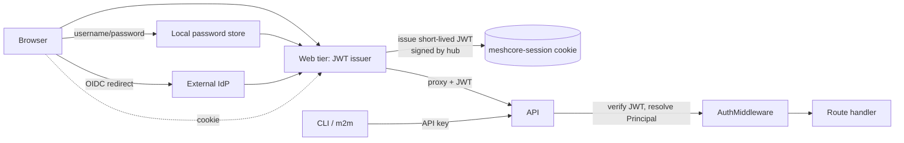

# Auth

> **Related decisions:** D6 (auth boundary — JWT issued by the web tier, verified at API middleware; `X-User-*` header injection removed), D12 (multi-source auth — OIDC optional, built-in local password store always available, `AUTH_MODE=local|oidc|hybrid` default **hybrid**, all sources converge on one JWT issuance), D18 (CLI for ops, not config — one config surface per item).
>
> **Note:** Code examples are illustrative pseudocode showing design patterns (shapes, flows, contracts).
> The implementation uses the TypeScript stack (D22): Fastify middleware, jose (JWT/JWS), argon2, Zod.

## One auth boundary, multiple credential sources



The defining property: **the API is credential-source-agnostic.** It verifies a JWT and resolves a `Principal`; it never knows *how* the web tier authenticated the user. That abstraction is what lets us offer multiple login methods without the API caring:

- **Web tier** mints a short-lived JWT (signed `HS256`/`RS256` with `OIDC_SESSION_SECRET`) carrying `sub`, `roles`, `instance_id`, `exp`, stored in the existing signed cookie. Every login path converges here.
- **API** verifies the JWT at a single middleware; handlers receive a resolved `Principal` (with `role_tier`, `user_id`, `instance_id`) via `Depends`. No more `X-User-*` header injection — the JWT *is* the credential. Fixes S1, S2.
- **Direct Bearer (API keys)** remain for m2m/CLI; they map to a `Principal` with a fixed role.
- **Channel visibility** (redaction, below) is computed from the `Principal`, once, per request.

### Credential sources (D12)

Three credential sources, each optional, all producing the same JWT:

| Source | When | How the web tier authenticates |
|---|---|---|
| **Local password store** *(always available — the default)* | Small/community deployments with no IdP; the "just works" path | `POST /auth/login` with username + password; verifies argon2id hash against `local_users` table |
| **OIDC/OAuth2** *(optional — configure if you have an IdP)* | Org/multi-user deployments wanting SSO | Existing redirect/callback flow; roles from the IdP claim |
| **API keys** *(always — for automation)* | CLI, scripts, other services talking to the API directly | Bearer token verified at the API middleware (no web tier involved) |

`AUTH_MODE` (Tier-1 env var) selects which interactive sources the login page offers:

- `local` — username/password form only. Zero external dependencies.
- `oidc` — "Sign in with SSO" button only. For orgs that mandate the IdP.
- **`hybrid` (default)** — both: the login page shows the OIDC button *and* the username/password form. Operators pick per user.

### Local password store

```sql
CREATE TABLE local_users (
  id              uuid PRIMARY KEY DEFAULT gen_random_uuid(),
  user_profile_id uuid NOT NULL REFERENCES user_profiles(id) ON DELETE CASCADE,
  username        text NOT NULL,
  password_hash   text NOT NULL,           -- argon2id
  enabled         boolean NOT NULL DEFAULT true,
  failed_attempts smallint NOT NULL DEFAULT 0,
  locked_until    timestamptz,             -- exponential lockout after N failures
  last_login      timestamptz,
  instance_id     uuid NOT NULL REFERENCES instances(id),
  created_at      timestamptz NOT NULL DEFAULT now(),
  updated_at      timestamptz NOT NULL DEFAULT now(),
  UNIQUE (instance_id, username)
);
```

- A `local_users` row links to a `user_profiles` row (so adoptions, tags, route ownership all work unchanged — they're keyed on `user_profile.id`). The profile's `user_id` is namespaced `local:<username>` to avoid colliding with OIDC `sub` claims.
- **Password hashing:** argon2id (via the `argon2` npm package, native bindings), parameterised at install time. Never bcrypt-only for new systems.
- **Rate limiting:** `failed_attempts` + `locked_until` give exponential lockout (e.g. 5 fails → 15s, 10 → 5m, 20 → 1h) without needing Redis. Optional IP-based throttling via the reverse proxy (`fail2ban` / `limit_req`) for defense in depth.
- **Bootstrap (D18 — CLI for ops, not config):** three paths to the first admin, pick by deployment style:
  - **Headless env-var:** `ADMIN_USERNAME` + `ADMIN_PASSWORD` (Tier-1) seed the initial admin on first boot. Password rotated via the UI afterward. For automated/infra-as-code deploys.
  - **Headless CLI:** `meshcore-hub admin create-user --username alice --role admin` (prompts for password). Same outcome, scriptable. For operators who provision users out-of-band.
  - **Interactive:** the web tier detects "no local admin exists" and serves a **first-run setup wizard** (see First-run setup wizard, below) instead of the dashboard — the operator creates the first admin in the browser. The common path for community operators.
  - No "default credentials" are ever shipped. Subsequent users are managed via the Users admin page (see Frontend component doc).

### Login flow convergence

Both paths land at the same JWT issuance:

```
OIDC callback success ─┐
                        ├─→ web tier mints JWT {sub, roles, instance_id, exp}
local password verified ┘     → sets meshcore-session cookie
                              → ensures a user_profiles row exists (idempotent)
                              → redirects to ?next=
```

`/auth/login` (local) and `/auth/callback` (OIDC) are the only two entry points; everything downstream — the cookie, the proxy, the API middleware, the `Principal` — is shared.

### Management

- **Local users** are managed via a Users admin page (fits naturally in the Settings UI / D11). Admins create users, assign roles, reset passwords, disable accounts — all runtime, no env-var changes.
- **OIDC users** are still provisioned just-in-time on first login (as today), with roles from the IdP claim; an admin can promote/demote via the same Users page.
- The `AUTH_MODE` setting itself stays Tier-1 (env var) because it affects which bootstrap credentials are required.

## JWT token shape & session model

Two artifacts: a **session cookie** (long-lived, the "refresh") and an **access JWT** (short-lived, per-request credential). The web tier mints a fresh access JWT from the session on each proxied request; the API only ever sees non-expired access JWTs. No separate refresh token reaches the API.

**Access JWT claims (HS256, signed with `OIDC_SESSION_SECRET`):**
```json
{
  "iss": "meshcore-hub",
  "sub": "local:alice",              // OIDC sub, "local:<username>", or "apikey:<role>"
  "instance_id": "<uuid>",
  "roles": ["admin"],
  "role_tier": "admin",              // pre-resolved: community < member < operator < admin
  "type": "access",
  "iat": 1759000000,
  "exp": 1759000300,                 // +5 minutes
  "jti": "<uuid4>"                   // for audit / future revocation list
}
```

- **5-minute access lifetime** — short enough that a stolen token has a tiny window, long enough that the web tier's per-request re-mint doesn't fight itself under burst load.
- **7-day session cookie** (`meshcore-session`, HttpOnly, SameSite=Lax, signed with `OIDC_SESSION_SECRET` via `jose` JWS — same mechanism, updated library). Sliding renewal: each proxied request reissues if past half-life.
- **RS256 option:** if an operator wants asymmetric signing (web tier holds private key, API verifies with public key), expose via `JWT_SIGNING_ALG=rs256` + `JWT_PRIVATE_KEY`/`JWT_PUBLIC_KEY` PEM paths. Default HS256 — single issuer, simpler ops.

## The Principal (resolved once per request)

Every handler receives a frozen `Principal` via `Depends`. It carries everything the request needs for authz, pre-resolved at the middleware so handlers never recompute it:

```typescript
@dataclass(frozen=True)
class Principal:
    user_id: str | None              # None = anonymous; "local:alice" / OIDC sub / "apikey:read"
    roles: frozenset[str]
    role_tier: str                   # highest resolved tier
    instance_id: UUID
    channel_indices: frozenset[int]  # visible channels, pre-resolved (redaction)

    @property
    def is_authenticated(self) -> bool: return self.user_id is not None
    @property
    def is_admin(self) -> bool:      return "admin" in self.roles
    @property
    def is_operator_or_admin(self) -> bool: return bool(self.roles & {"admin", "operator"})
```

Dependency aliases replace today's scattered `RequireRead`/`RequireAdmin`/`RequireUserOwner`:
```typescript
RequireRead   = Annotated[Principal, Depends(lambda p: p)]                       # any caller
RequireMember = Annotated[Principal, Depends(require_authenticated)]             # any logged-in
RequireAdmin  = Annotated[Principal, Depends(require_role("admin"))]
RequireOperatorOrAdmin = Annotated[Principal, Depends(require_any_role("admin","operator"))]
```

## AuthMiddleware (single resolution point)

Replaces today's split between `api/auth.py` (Bearer), `web/app.py` (header injection), and the handlers that read `X-User-*` directly (S2). One middleware, one resolution:

```typescript
// Fastify preHandler hook — runs before every route handler
async function authMiddleware(request: FastifyRequest, reply: FastifyReply) {
    request.principal = await resolve(request);
}

async function resolve(request: FastifyRequest): Promise<Principal> {
    const instanceId = this.instanceId;  // process-level (Tier-1 env)
    // 1. JWT from Authorization header (set by the web tier proxy, or direct API access)
    const token = bearerToken(request);
    if (token) {
        const claims = jwtDecode(token, this.signingKey);   // throws → 401
        return Principal.fromJwt(claims, this.channelResolver);
    }
    // 2. Session cookie (browser access — single-process mode, or SSE via proxy)
    //    Only active when this process also serves the web tier. The cookie is
    //    a JWS signed with OIDC_SESSION_SECRET; verify inline → resolve Principal.
    const cookie = request.cookies?.["meshcore-session"];
    if (cookie && this.cookieVerifier) {
        const session = this.cookieVerifier.verify(cookie);  // throws on tamper/expiry → 401
        return Principal.fromSession(session, this.channelResolver);
    }
    // 3. API key (direct API access — CLI/automation)
    const key = apiKeyFrom(request, this.readKey, this.adminKey);
    if (key) {
        return Principal.fromApiKey(key, this.readKey, this.adminKey, instanceId, this.channelResolver);
    }
    // 4. Anonymous (public read)
    return Principal.anonymous(instanceId, this.channelResolver);
}
```

`channelResolver` is a cached `instanceId → visible-channel-indices` lookup (replaces the per-request `SELECT * FROM channels` scan).

## Local auth endpoints (D12)

```typescript
@router.post("/auth/login")
async def local_login(body: Credentials, request: Request) -> RedirectResponse:
    user = await verify_local_credentials(body.username, body.password, request.app.state)
    if user is None:
        raise HTTPException(401, "invalid credentials")
    return _start_session(user, request)   # mints session cookie, redirects to ?next=

@router.post("/auth/logout")
async def logout(request: Request) -> RedirectResponse: ...

# OIDC endpoints unchanged: /auth/login (when AUTH_MODE has oidc), /auth/callback, /auth/logout
```

The login page renders the local form, the OIDC button, or both based on `PublicConfig.auth_mode` (see Frontend component doc, Login page).

## First-run setup wizard (the interactive bootstrap path)

When the web tier starts and detects **no local admin exists** (`SELECT count(*) FROM local_users lu JOIN user_profiles up ON lu.user_profile_id = up.id JOIN user_profile_roles upr ON upr.profile_id = up.id WHERE upr.role = 'admin'` returns 0), it gates every route behind a one-time setup flow instead of the dashboard:

```typescript
// Fastify plugin — gate middleware (active only while needsSetup is true)
fastify.addHook("preHandler", async (request: FastifyRequest, reply: FastifyReply) => {
    if (fastify.state.needsSetup && !["/setup", "/health"].includes(request.url.split("?")[0])) {
        return reply.redirect(302, "/setup");
    }
});
```

**`GET/POST /setup`** — a multi-step wizard (served server-rendered so it works before the SPA bootstrap):

1. **Welcome / network identity** — network name, city, country, contact (writes the Tier-2 branding settings that are otherwise empty on a fresh DB).
2. **Admin account** — username + password + confirm. Creates the first admin (see bootstrap insert sequence below).
3. **Auth mode** — local (default) / oidc (enter IdP config) / hybrid. Sets the Tier-1 `AUTH_MODE`-equivalent as a setting.
4. **Feature flags** — which pages to enable (sensible defaults pre-checked).
5. **Done** — sets `fastify.state.needsSetup = false`, redirects to the dashboard, logged in as the new admin.

### Bootstrap insert sequence (shared by all three paths)

Every bootstrap path (env-var, CLI, setup wizard) performs the same atomic 3-table insert inside one transaction:

```sql
-- 1. Create the profile (user_id namespaced as local:<username>)
INSERT INTO user_profiles (user_id, name, instance_id)
VALUES ('local:alice', 'Alice', :instance_id)
RETURNING id;
-- 2. Create the local login credential
INSERT INTO local_users (user_profile_id, username, password_hash, instance_id)
VALUES (:profile_id, 'alice', :argon2id_hash, :instance_id);
-- 3. Assign the admin role
INSERT INTO user_profile_roles (profile_id, role)
VALUES (:profile_id, 'admin');
```

The transaction is all-or-nothing. The `user_id = 'local:<username>'` namespace avoids colliding with OIDC `sub` claims. After this commit, `needsSetup` flips to false permanently (any admin existing = setup complete).

The gate is **idempotent**: once any admin exists, `/setup` 404s and the gate disables itself. The env-var and CLI bootstrap paths short-circuit the wizard entirely — if `ADMIN_USERNAME`/`ADMIN_PASSWORD` seeds an admin before the web tier first boots, the operator lands straight on the dashboard.

This gives the community operator the "start the stack, open the browser, follow the wizard" experience with zero CLI/env editing, while headless deployers use the env vars or CLI and never see the wizard.
