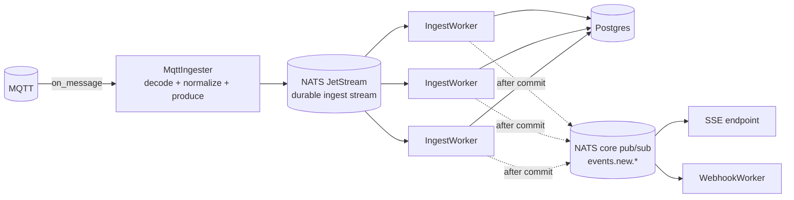

# Ingest

> **Related decisions:** D4 (NATS JetStream for ingest queue + realtime fan-out), D5 (fold `packet_path_hops` — spike)
>
> **Source:** Restructured from `REWRITE.md` §7.1 (split receipt from write), §7.3–7.6 (typed envelopes,
> dedup, scheduler, raw capture), §17.1–17.6 (Phase 1 ingest pipeline concrete design).
>
> **Note:** Code examples are illustrative pseudocode showing design patterns (shapes, flows, contracts).
> The implementation uses the TypeScript stack (D22): Fastify, Drizzle ORM, @nats-io/jetstream, mqtt.js, Zod.

---

## 1. Split receipt from write

Today, MQTT receipt and DB write are one synchronous function on one thread. The rewrite pulls them apart:



- **`MqttIngester`** is pure: receive → decode (via `meshcoredecoder`) → normalize to a typed envelope → produce to queue. It writes **nothing** to the DB. It can be restartable, replayable, and horizontally scalable (consumer groups). Burst absorption is the queue's job. Fixes W1, P1.
- **`IngestWorker`** consumes batches from the queue, opens one DB transaction per batch, runs the dedup+persist logic, commits, publishes an "event persisted" notification. Scales horizontally. Batching collapses the per-message session overhead. Fixes P4.

---

## 2. Normalize to typed envelopes, not dicts

Replace the 1,200-line `LetsMeshNormalizer` field-extraction sprawl (P1, P6) with:

- **Zod `DecodedPacket` schemas** matching `@michaelhart/meshcore-decoder` output (contribute these upstream if possible to kill `_enrich_payload_decoded` / `_flatten_control_parsed`).
- A **single declarative classification table** (payload-type → event-type → handler) — one source of truth, eliminating P7.
- A **stateless `PacketFields` utility module** (composition, not inheritance) consumed by both the ingester and any API path that needs to re-derive fields.

### Declarative classification (single source of truth)

```typescript
# One declarative classification table — the single source of truth (replaces P7).
CLASSIFIERS: list[Classifier] = [
    ChannelMessageClassifier(),      # payload_type 5 → channel_msg_recv
    ContactMessageClassifier(),      # payload_type 1|2|7 → contact_msg_recv
    AdvertisementClassifier(),       # payload_type 4 (+ identity metadata)
    TraceClassifier(),               # payload_type 9
    ContactDiscoverClassifier(),     # payload_type 11, subType 0x90
    TelemetryClassifier(), BatteryClassifier(), PathClassifier(), StatusClassifier(),  # type 1 branches
    FallbackClassifier(),            # the 0x00–0x0F table → informational event_type
]
```

Each `Classifier` produces a typed `PacketFields` summary (the `decode.meta` block of the ingest envelope below) from a `DecodedPacket`. No `Subscriber` god-class, no `self._normalize_*` cascade.

---

## 3. Dedup as a first-class service

Centralize the 4× duplicated dedup boilerplate (P4) into one helper:

```typescript
def persist_deduped_event(
    session, *, event_type, event_hash, build_fn, observer, observer_meta
) -> EventPersistResult: ...
```

- Computes the SHA-256 content hash.
- `INSERT ... ON CONFLICT (instance_id, event_hash) DO NOTHING` (Postgres-native; drop the dialect branch). The conflict target is the **composite** `(instance_id, event_hash)` unique — dedup is per-tenant, so the same physical packet creates one event *per* instance (multi-tenancy.md §10).
- On conflict, just attaches the observer.
- Returns whether it was a new event (drives the pub/sub fan-out — only fire webhooks/realtime on first sighting).

### The worker-side helper

```typescript
# One dedup helper — used by every structured handler (P4).
async def persist_deduped_event(
    session: AsyncSession,
    *,
    model: type[DeclarativeBase],
    event_hash: bytes,               # sha256(content)[:16]
    build_row: Callable[[], dict],
    observer_id: UUID,
    observer_meta: ObserverMeta,
) -> DedupResult:
    """INSERT ... ON CONFLICT (instance_id, event_hash) DO NOTHING; attach observer either way.
    Composite conflict target = per-tenant dedup (F1). Returns DedupResult(is_new, event_id, event_hash).
    Native Postgres — no dialect branch."""
    ...

# Each handler is ~15 lines, not ~50.
class ChannelMessageHandler(EventHandler):
    model = Message
    def event_hash(self, env: IngestEnvelope) -> bytes:
        return sha256(f"{env.text}|{env.pubkey_prefix}|{env.channel_idx}|{env.sender_ts}|{env.txt_type}".encode())[:16]
    def build_row(self, env, observer_id, instance_id) -> dict: ...
```

---

## 4. One scheduler, not six threads (P3)

A single `DerivedStateWorker` process runs a registered set of periodic jobs:

```
every 300s : route-evaluator (refresh route_results + route_recent_matches from raw_receptions.path_hashes)
every 3600s: route-history (refresh completed-day buckets in route_result_history)
every 120s : spam-rescore (DB function sweep over recent messages)
every 5m   : channel key refresh (push to ingesters via NATS, not a thread)
hourly     : retention enforcement (chunk drops for hypertables, chunked DELETE for OLTP — W10)
daily      : recompute observer flags
```

Implemented with a small library (`node-cron`, or a home-grown `PeriodicTask` that collapses the 5 identical loops into ~50 LOC). One process, one set of metrics, one shutdown path.

> **Note:** The detailed job manifest, scheduler implementation (`pg_advisory_xact_lock` for HA), and the spam-retention/retention logic live in `components/derived-state.md`. This doc is the *ingest* surface; the worker that maintains derived state is its own component.

---

## 5. Raw capture: compress in-DB, defer object storage

### Default (D8 off — the shipping path)

`raw_hex` stays on the `raw_receptions` row; TimescaleDB columnar compression (10–20×) keeps storage cost manageable. The `object_key` column ships nullable in Phase 0 so a later move to external storage is config-only. Same for `telemetry.object_key` (raw LPP bytes).

Fixes W2's duplicate-payload-storage problem: `decoded_summary` for list views, `decoded` for detail views, `raw_hex` for raw-bytes inspection.

### The BlobStore interface (the seam)

Ships in Phase 0 as a no-op; activated only if D8 measurement demands it.

```typescript
interface BlobStore {
    put(key: string, data: Buffer): Promise<string>;   // returns the object_key
    get(key: string): Promise<Buffer | null>;           // null = not found
    delete(key: string): Promise<void>;
}
```

Three implementations:

| Implementation | When | Config |
|---|---|---|
| `NoopBlobStore` *(default)* | D8 off — `put` is a no-op, `get` returns null | none |
| `LocalVolumeBlobStore` | Single-server deployments with a mounted volume | `BLOB_STORE_TYPE=local`, `BLOB_STORE_PATH=/data/blobs` |
| `S3BlobStore` | Multi-node or cloud deployments (S3, MinIO, Ceph, etc.) | `BLOB_STORE_TYPE=s3`, `BLOB_STORE_ENDPOINT`, `BLOB_STORE_BUCKET`, credentials |

The IngestWorker injects the `BlobStore` (dependency injection). When `NoopBlobStore` is active, the worker writes `raw_hex` to the row and leaves `object_key` null. When a real implementation is active, the worker writes bytes through `put()`, stores the returned `object_key`, and nulls `raw_hex`.

### Storage strategy per column (D8 off vs on)

| Column | D8 off (default) | D8 on | Rationale |
|---|---|---|---|
| `raw_hex` | populated (compressed in-column) | **nulled** (bytes in object store) | Largest column; hex text has high entropy → poor in-column compression ratio vs the object store |
| `object_key` | null | populated | Points to the blob |
| `decoded_summary` | populated | populated | Small JSONB for list views; stays either way |
| `decoded` | populated | populated | Full decoder output for detail views. JSONB compresses 10–20× in-column (repetitive key names, common value patterns) — better than `raw_hex` ever would |

Key insight: `decoded` stays on the row even when D8 is activated. Only `raw_hex` moves. The structured JSON compresses well enough that the storage win from offloading it doesn't justify the extra hop (DB → object store fetch) on every detail view.

### Activation process (if measurement demands)

1. Set `BLOB_STORE_TYPE=local|minio|s3` + the corresponding config (Tier-1 env vars — they determine how to connect to the store at startup).
2. Restart the IngestWorker. New packets: bytes go through `BlobStore.put()`, `object_key` is set, `raw_hex` is nulled on insert.
3. Run `meshcore-hub admin backfill-blobs` — a one-time CLI job that reads existing rows where `raw_hex IS NOT NULL AND object_key IS NULL`, writes each through `BlobStore.put()`, sets `object_key`, and nulls `raw_hex`. Batched (5000 rows/batch) to avoid long transactions. For compressed chunks, TimescaleDB decompresses rows on UPDATE — this is the expected cost of the backfill.

### Measurement criteria (when to decide)

- **When:** Phase 2, after the new stack has run with live data for at least 1 week.
- **What:** `SELECT * FROM hypertable_compression_stats('raw_receptions')` — check the compressed size of `raw_receptions` vs total DB size. Also project monthly disk growth.
- **Activate if:** compressed `raw_receptions` exceeds ~50% of total DB size AND monthly growth is on track to exceed the operator's storage budget. Or: detail-view latency on `raw_receptions` degrades noticeably due to decompression cost under load.
- **Don't activate if:** TimescaleDB compression alone keeps 30 days of data within budget. Most community-mesh deployments (1–4 observers, hundreds of packets/day) will not need object storage.

---

## 6. NATS topology

One JetStream stream + two core (non-durable) subject families. The stream is **single and
platform-wide** — tenancy is a subject token, not a separate stream. This matters: a JetStream consumer
group cannot span multiple streams, and Phase 7's shared worker pool subscribes across all tenants with a
wildcard. One stream from Phase 0 makes multi-tenancy purely additive (D21).

| Stream/Subject | Type | Subjects | Producers | Consumers |
|---|---|---|---|---|
| `INGEST` | JetStream, durable, `WorkQueuePolicy` | `meshcore.ingest.>` (per-instance tokens: `meshcore.ingest.<inst>.<feed>`) | MqttIngester | IngestWorker consumer group (durable `workers`, `ack_explicit`) — one shared consumer, all replicas bind to it |
| `events.new.<inst>` | Core pub/sub (non-durable) | `events.new.<inst>.{messages,advertisements,...}` | IngestWorker (after commit) | API SSE endpoint(s), WebhookWorker |
| `channel.keys.<inst>` | Core pub/sub | `channel.keys.<inst>.updated` | IngestWorker (after channel mutation) | MqttIngester (reload `ChannelKeyCache`) |

Stream config: `duplicate_window = 5m` (server-side dedup on `Nats-Msg-Id` = packet `wire_hash`; in
multi-tenant mode the id is tenant-prefixed — multi-tenancy.md §4), `max_age = 7d` (replay window for
worker restarts), `storage = file`, `retention = limits`.

> Single-tenant mode is just one instance's subjects flowing through the same `INGEST` stream — no
> per-instance stream to create, and the wildcard consumer already covers every future tenant.

---

## 7. The ingest envelope (`meshcore.ingest.v1`)

JSON for v1 (debuggable; the decode is the expensive part, not serialization). Switch to msgpack/protobuf later only if profiling demands.

```jsonc
{
  "schema": "meshcore.ingest.v1",
  "ingested_at": "2026-07-25T12:00:00.123Z",
  "instance_id": "<uuid>",
  "observer": {
    "public_key": "<64 hex, lowercased>",
    "iata": "IPT",
    "feed": "packets"            // "packets" | "status" | "internal"
  },
  "wire_hash": "<32 hex>",       // LetsMesh on-air hash; becomes Nats-Msg-Id
  "mqtt": {
    "topic": "meshcore/IPT/<pubkey>/packets",
    "qos": 1,
    "dup": false
  },
  "decode": {
    "raw_hex": "<on-air bytes hex>",
    "packet_type": 5,
    "payload_type": 4,
    "decoded": { /* full meshcoredecoder output dict */ },
    "meta": {                    // post-normalize, typed — consumed verbatim by the worker
      "event_type": "channel_msg_recv",
      "snr": 8.5,
      "path_len": 10,
      "path_hashes": ["4a", "b3fa", "02"],
      "path_hash_width": 1,
      "channel_idx": 17,
      "source_pubkey_prefix": "01ab2186c4d5",
      "route_type": "flood",
      "advert_timestamp": null
    },
    "classify_trace": ["GRP_TXT", "ChannelMessageClassifier"]  // for observability/debug
  }
}
```

The envelope is **immutable** once produced. The MqttIngester is a pure `topic + raw_bytes → envelope` function; it never touches the DB. Channel-key decryption needs DB-resident keys — resolved via the `ChannelKeyCache` (§9).

---

## 8. MqttIngester (pure decoder + producer)

```typescript
class MqttIngester:
    def __init__(
        self,
        mqtt: MqttClient,
        js: JetStreamClient,           # publish client (@nats-io/jetstream)
        decoder: MeshCoreDecoder,
        key_cache: ChannelKeyCache,              # §9
        observer_filter: ObserverFilter,
        instance_id: UUID,
    ) -> None: ...

    async def on_message(self, topic: str, payload: bytes) -> None:
        # 1. parse topic → observer pubkey / iata / feed (TopicBuilder, unchanged grammar)
        # 2. observer allow/deny (prefix match) — cheap, pre-decode
        # 3. envelope = self._build_envelope(topic, payload)   # decode + normalize + classify
        # 4. ack = await js.publish(
        #        subject=f"meshcore.ingest.{self.instance_id}.{envelope.observer.feed}",
        #        headers: { "Nats-Msg-Id": envelope.wire_hash })   # server-side dedup
        # No DB writes. No blocking on the DB. Bursts absorbed by JetStream.
```

Decoupling win: a DB stall no longer stalls MQTT. The ingester's only external dependencies are the broker, NATS, and the read-only `ChannelKeyCache`. Horizontal scale = run N ingesters sharing the same MQTT subscription (shared subscription) — though one is usually enough.

---

## 9. IngestWorker (batched writer)

```typescript
class IngestWorker:
    def __init__(
        self,
        js: JetStream,
        db: DbPool,                       // node-postgres pool (Drizzle)
        blob: BlobStore,                  // no-op when D8 off
        bus: NatBus,                      // core pub/sub for events.new + channel.keys
        handlers: HandlerRegistry,
        instance_id: UUID,
        batch_size: int = 100,
    ) -> None: ...

    async run(): Promise<void> {
        // Subscribe to the whole ingest subject tree (all instances). `meshcore.ingest.*` would only
        // match a 3-token subject; the real subjects are 4-token (meshcore.ingest.<inst>.<feed>).
        const sub = await this.js.pullSubscribe("meshcore.ingest.>", { durable: "workers" });
        while (this._running) {
            const msgs = await sub.fetch(this.batchSize, { timeout: 5000 });
            await this._processBatch(msgs);
        }

    async _processBatch(msgs: Msg[]): Promise<void> {
        const envelopes = msgs.map(m => IngestEnvelopeSchema.parse(JSON.parse(decoder.decode(m.data))));
        const newEvents: EventPersisted[] = [];
        await this.db.transaction(async (tx) => {
            await tx.execute(sql`SET LOCAL app.instance_id = ${this.instanceId}`);
            for (const env of envelopes) {
                const result = await this.handlers.handle(tx, env);  // §10
                if (result.isNew) newEvents.push(result.eventPub);
            }
        });
        // After commit: fan out + ack. Order matters — only ack after NATS publish succeeds.
        for (const ev of newEvents) {
            await this.bus.publish(`events.new.${this.instanceId}.${ev.table}`, ev.payload);
        }
        for (const m of msgs) {
            await m.ack();
        }
    }
```

Batching = one transaction per up-to-100 envelopes → collapses today's one-session-per-message overhead. Consumer-group `durable="workers"` lets multiple workers share the stream.

Two ordering guarantees in `_process_batch`:

1. **Commit before publish.** The `events.new.*` notification only fires for rows that actually committed — clients never see a real-time event for an uncommitted write.
2. **Publish before ack.** The JetStream `ack()` happens only after the realtime fan-out publish succeeds, so a worker crash mid-batch redelivers the un-acked messages instead of dropping a real-time notification.

---

## 10. Centralized dedup + handler registry

Replaces the 4× duplicated handler boilerplate (P4) and the duplicated classification maps (P7). The `CLASSIFIERS` list was shown in §2; the worker-side dedup helper was shown in §3. Together they collapse the handler surface to:

- A declarative classifier list (ingester-side) → typed `meta` block in the envelope.
- A single `persist_deduped_event` helper (worker-side) → one dedup path for every event type.
- ~15-line per-event handlers that just supply `model`, `event_hash`, and `build_row`.

No `Subscriber(LetsMeshNormalizer)` god-class. No `self._normalize_*` cascade. No per-handler `INSERT ... ON CONFLICT` boilerplate.

### Node upsert + `last_seen` maintenance

Every envelope references a source node (`source_pubkey_prefix` or the full `public_key` from adverts). The IngestWorker maintains the `nodes` table as a side-effect of event persistence:

```typescript
// Called once per envelope, before the event handler runs.
// Find-or-create the node; update last_seen + mutable fields on adverts.
async function touchNode(tx: Tx, env: IngestEnvelope, instanceId: string): Promise<string> {
    const pubkey = env.decode.meta.source_pubkey_full ?? env.decode.meta.source_pubkey_prefix;
    if (!pubkey) return null;   // status/internal feeds may lack a pubkey

    if (env.decode.meta.event_type === 'advertisement') {
        // Adverts carry authoritative node metadata — upsert all mutable fields
        const [node] = await tx.insert(nodes).values({
            public_key: pubkey,
            name: env.decode.decoded.name ?? null,
            adv_type: env.decode.decoded.adv_type ?? null,
            flags: env.decode.decoded.flags ?? null,
            lat: env.decode.decoded.lat ?? null,
            lon: env.decode.decoded.lon ?? null,
            is_observer: env.observer.is_observer,
            last_seen: env.ingested_at,
            instance_id: instanceId,
        }).onConflictDoUpdate({
            target: [nodes.instance_id, nodes.public_key],   // composite unique — per-tenant node rows
            set: {
                name: sql`COALESCE(EXCLUDED.name, nodes.name)`,
                adv_type: sql`EXCLUDED.adv_type`,
                flags: sql`EXCLUDED.flags`,
                lat: sql`COALESCE(EXCLUDED.lat, nodes.lat)`,
                lon: sql`COALESCE(EXCLUDED.lon, nodes.lon)`,
                is_observer: sql`EXCLUDED.is_observer`,
                last_seen: sql`EXCLUDED.last_seen`,
                updated_at: sql`now()`,
            },
        }).returning();
        return node.id;
    }

    // Non-advert events: just bump last_seen (don't overwrite metadata)
    const [node] = await tx.insert(nodes).values({
        public_key: pubkey,
        last_seen: env.ingested_at,
        instance_id: instanceId,
    }).onConflictDoUpdate({
        target: [nodes.instance_id, nodes.public_key],
        set: { last_seen: sql`EXCLUDED.last_seen`, updated_at: sql`now()` },
    }).returning();
    return node.id;
}
```

### The observing node must exist too

The reception/junction rows carry `observer_node_id` (a loose `nodes.id` reference — no FK, F6). The
worker therefore **find-or-creates the observing node** as well, using the same instance-scoped upsert as
`touchNode` (keyed on `(instance_id, observer.public_key)`), before writing `raw_receptions` /
`event_observers`. Because those columns are loose references (no FK), a stale id would not error — but
resolving it here keeps the observer's `nodes` row present and `last_seen` current. The observer upsert
and the source `touchNode` run in the same batch transaction (one round-trip each, deduplicated within
the batch when many envelopes share an observer).

- **Adverts** are the authoritative source for node metadata (name, type, flags, GPS). `COALESCE` preserves existing values when the advert field is null (partial adverts).
- **Non-advert events** (messages, traces, telemetry) only bump `last_seen` — they don't carry name/GPS metadata.
- **Observer flag** (`is_observer`): set from the envelope's `observer.is_observer` (derived from the MQTT topic's IATA code matching a known observer list). The `recompute_observer_flags` DerivedStateWorker job (daily) cross-checks against `nodes` that have recent observer-traffic but lack the flag.
- **`first_seen`**: set once at insert (`DEFAULT now()`); never updated.
- **Batched**: `touchNode` runs inside the same transaction as the event handler — one round-trip per envelope, not an extra query.

---

## 11. ChannelKeyCache (ingester-side, DB-fed)

The ingester needs channel keys to decrypt channel messages, but must not do a DB hit per packet. Resolution:

- `ChannelKeyCache` loads `SELECT key_hex, key_hash FROM channels WHERE enabled` on startup (one query).
- Subscribes to `channel.keys.<inst>.updated` (core NATS); on notification, reloads atomically under a lock.
- The IngestWorker publishes `channel.keys.<inst>.updated` after every successful channel mutation (commit), before ack.
- Thread-safe reload (fixes P5's race): single-writer (the reload task), readers go through an immutable snapshot reference.

This is the only place the ingester touches DB-shaped data, and it's a read-only snapshot refreshed by event — preserving the "ingester does no DB writes" boundary.

### Why this beats the current `decode_cache`

- The current `letsmesh_decoder` cache (P5) is process-local, unbounded by memory, and not thread-safe across the paho thread + the channel-refresh thread.
- The new `ChannelKeyCache` is bounded (one row per enabled channel), refreshed by event (no polling thread), and read through an immutable snapshot reference (no lock contention on the read path).
- It's also the *only* DB-shaped data the ingester holds — everything else comes in on the MQTT wire.

---

## 12. Webhook delivery (D19)

Webhooks are delivered by a **`WebhookWorker`** — a separate NATS core subscriber on the same `events.new.<inst>.*` fan-out the SSE endpoint uses. The IngestWorker's post-commit path stays lean (commit → publish → ack); webhook dispatch is decoupled.

```typescript
class WebhookWorker {
    constructor(private nats: NATSClient, private settings: SettingsCache,
                private instanceId: string) {}

    async run(): Promise<void> {
        const sub = await this.nats.subscribe(`events.new.${this.instanceId}.>`);
        for await (const msg of sub) {
            const event = JSON.parse(decoder.decode(msg.data));
            for (const hook of this.settings.webhookConfigs(event.type)) {
                if (hook.matchesFilter(event.payload)) {
                    await this.dispatch(hook, event);  // undici/fetch, 3 retries, exponential backoff
                }
            }
        }
    }
```

- **Config:** Tier-2 settings (`settings` table, `webhooks` category) — URLs, secrets, event-type filters, retry tuning. Runtime-editable via the Admin UI; propagated via `settings.updated.<inst>.webhooks`.
- **Filter DSL:** the JSONPath-like expression (`$.dotted.path operator value`) is wired into production (today it's test-only). Each webhook config entry carries an optional `filter_expression` evaluated against the event payload.
- **Durability:** best-effort (NATS core is non-durable). Matches today's semantics (in-memory queue, lost on crash). If durability becomes a requirement, upgrade to a JetStream durable consumer with a staleness guard.
- **Events:** only `is_new` events (first sighting) trigger webhooks — the `events.new.*` notification already carries this flag. Event types: `advertisement.new`, `message.new` (channel + contact).
