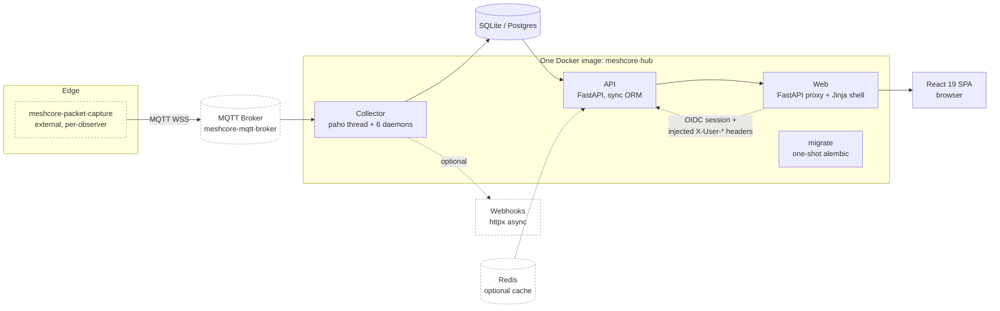

# Overview — Why We're Rewriting

> **Source:** Restructured from `REWRITE.md` §1–§4 (analysis) and §5.1 (principles).
> This is the "why we're rewriting" document. The pain-point tables are the justification
> and are preserved in full — every row, every `file:line` evidence pointer.

---

## 1. Executive Summary

MeshCore Hub is a mature, feature-rich platform that has grown organically over ~8 months and 30 migrations. It does a lot well: multi-observer aggregation, raw packet inspection, route health monitoring, OIDC auth, spam scoring, internationalization, and a polished dashboard. The feature set is essentially correct.

The **architecture** is what's straining. The strain shows up as:

- **A write-path bottleneck** — a single-threaded MQTT callback with no backpressure, where one slow DB write stalls all ingest.
- **A storage model fighting itself** — `raw_packets` (16 cols, 9 indexes, one row per observer reception) + `packet_path_hops` (write-amplified per hop) dominate write cost and have already required a perf-remediation migration. The route-health subsystem is a hand-rolled materialized-view layer of 7 tables maintained by 6 background threads.
- **Polyglot complexity hiding in one process** — six daemon threads with three different execution models (sync-on-MQTT-thread, async-in-thread, sync-in-thread), a god-class `Subscriber(LetsMeshNormalizer)`, and a 1,200-line field-extraction normalizer.
- **A cache layer with no single source of truth** — Redis keys in two (arguably three) formats, each invalidation helper hand-coded to know the namespaces, mandated by AGENTS.md as a hard rule because the alternative is staleness.
- **A frontend that hand-copies backend types** into every page, ships a 776 KB un-split bundle, and polls an uncacheable per-request HTML shell.
- **A dual auth model** (direct Bearer vs OIDC-proxy-injected headers) whose trust boundary is implicit ("only the proxy holds the API key") rather than enforced.

The proposal below keeps the **product** and the **domain model** (the *what*), but reshapes the **system** (the *how*) around four principles:

1. **Separate the hot write path from the query path** with an explicit ingest pipeline (queue → worker → OLTP) and a read-optimized store.
2. **Use the right tool for each workload** — Postgres for transactional state, a columnar/timeseries tier for high-volume packet & telemetry history (with in-DB compression as the default; object storage behind an interface if measurement demands it), Redis for ephemeral realtime, and a static frontend shell that can be CDN-cached.
3. **Collapse background-thread sprawl** into a single durable scheduler and move derived state (route health, spam rescoring) into the database as incrementally-maintained views or a small dedicated worker.
4. **Make types and contracts first-class** — one OpenAPI schema generated from the server, consumed by a typed client in the frontend, eliminating the hand-copy drift.

The biggest "if we were starting fresh" lever is **introducing a second datastore** for the high-volume append-only streams (`raw_packets`, `packet_path_hops`, `telemetry`, `events_log`). That single change dissolves the write-amplification problem, removes the 2-day raw retention ceiling, and lets Postgres shrink back to a well-indexed operational store for entities, routes, channels, profiles and dedup'd events.

---

## 2. Current System Inventory

### 2.1 Topology (today)

- **Single image, multiple commands.** One Dockerfile; services distinguished by `command:` (`collector`, `api`, `web`, `db upgrade`). Three runtime services + a one-shot migrate.
- **Optional sidecars:** bundled MQTT broker (`meshcore-mqtt-broker`), Redis 8, Postgres 17, and the `meshcore-packet-capture` observer. Most production deployments connect to external MQTT.
- **Two DB backends:** SQLite (default, deprecated ~3 months) and Postgres (opt-in, `DATABASE_BACKEND=postgres`). Schema-per-instance isolation via `search_path`.

### 2.2 Feature inventory

| Domain | Feature | Notes |
|---|---|---|
| **Ingest** | MQTT upload feeds (`packets`, `status`, `internal`) | 3 wildcard topics; only ingest path |
| | Packet decode (meshcoredecoder lib) + 2048-entry cache | per-hex cache, FIFO eviction |
| | Payload-type classification (0x00–0x0F) | normalizer cascade |
| | Multi-observer aggregation | `event_observers` junction + dialect-aware upsert |
| | Content-hash dedup (MD5) | per event type, with time-bucketing for ads/telemetry |
| | Raw packet capture | one row per observer reception, 2-day retention |
| | Packet path-hop expansion | `packet_path_hops`, per reception × hop |
| | Spam scoring (online + rescore sweep) | `path_prefix` + `sender_normalized`, 0–1 score |
| | Observer allow/deny filters | prefix-match, applied pre-decode |
| | Webhooks (advert/channel-msg/direct-msg) | async, retry+backoff, JSONPath-like filter DSL |
| | Data retention + node cleanup | hourly sweep; chunked? no — single DELETE per table |
| **Entities** | Nodes (public_key, name, type, flags, gps, is_observer) | FK hub — 14 inbound FKs |
| | Node tags (key/value/value_type) | operator/admin CRUD |
| | User profiles + roles | OIDC sub; roles as CSV text |
| | Node adoption (one adopter per node) | `user_profile_nodes` |
| | Channels (name, key, hash, visibility tier) | community/member/operator/admin |
| **Events** | Messages (contact + channel) | dedup'd, with packet_hash backlink |
| | Advertisements | dedup'd with advert_timestamp windowing |
| | Trace paths | parallel-array JSON antipattern |
| | Telemetry | JSON `parsed_data` + raw LPP bytes |
| | Event log (catch-all audit sink) | unbounded JSON payload |
| **Route health** | Route definitions (nodes, observers, thresholds, window) | visibility tiered |
| | Route results (1:1 cache) + per-day history + recent matches | hand-rolled materialized views |
| | Subsequence matcher over packet_path_hops | forward + reverse |
| | Preview (live evaluation) | API endpoint |
| **API** | REST `/api/v1/*`, OpenAPI/Swagger/ReDoc | 13 routers |
| | Bearer-token auth (read/admin keys) | machine-to-machine |
| | OIDC web-session auth (proxy-injected headers) | browser flows |
| | Role-aware channel-visibility redaction | 4 tiers |
| | Redis response cache + ETag/304 + invalidation helpers | dual key formats |
| | Prometheus metrics | TTL-cached, many COUNTs |
| **Web UI** | Home, Dashboard, Nodes, Node detail (+QR), Channels (+QR) | React 19 SPA |
| | Messages, Advertisements, Packets, Packet-group detail, Packet detail | polling |
| | Routes (CRUD modal), Map (Leaflet), Members, Profile, Custom pages | |
| | Theme toggle (dark/light), i18n (en/nl), auto-refresh, announcements | |
| | Node tagging CRUD, adoption, route management, channel management | auth-gated |

### 2.3 Data model at a glance (19 tables)

| Table | Volume | Role | Notes |
|---|---|---|---|
| `nodes` | low | entity hub | 14 inbound FKs; `public_key` unique |
| `node_tags` | low | metadata | UC(node,key) |
| `user_profiles`, `user_profile_nodes` | low | identity/adoption | roles as CSV |
| `channels` | low | config + visibility | name/key unique |
| `routes`, `route_nodes`, `route_observers` | low | route definitions | |
| `route_results`, `route_result_history`, `route_recent_matches` | medium | **derived** route health | maintained by background evaluator |
| `messages` | medium-high | dedup'd events | spam cols, dual-hash |
| `advertisements` | medium-high | dedup'd events | advert_timestamp windowing |
| `trace_paths` | medium | dedup'd events | parallel-array JSON |
| `telemetry` | medium | dedup'd events | JSON + binary |
| `events_log` | high | catch-all audit | unbounded JSON |
| `event_observers` | high | multi-observer junction | UC(hash,node) |
| `raw_packets` | **very high** | per-observer raw capture | 16 cols, 9 indexes, 2-day retention |
| `packet_path_hops` | **very high** | denormalized path expansion | write-amplified; Postgres covering index |

PKs are `String(36)` UUIDs (not native `uuid`); enums are `String(20)`; JSON columns are `JSON` (not `JSONB`).

### 2.4 Collection process (today)

1. paho network thread receives an MQTT message → `_handle_mqtt_message`.
2. Observer filter (allow/deny prefix) — cheap, pre-decode.
3. `LetsMeshNormalizer._normalize_letsmesh_event` → `(public_key, event_type, payload)` via a cascade of `_extract_*` / `_normalize_*` helpers, with per-hex decode cache.
4. If raw capture is on, insert `raw_packets` + `packet_path_hops` **before** structured dispatch.
5. Dispatch to a handler by `event_type` (4 "real" handlers do find-or-create receiver → content-hash dedup → insert → `add_event_observer`; everything else falls to `handle_event_log`).
6. Backfill `event_hash` onto the captured `raw_packet` + hops.
7. Queue webhook event onto an in-process list.
8. **All of the above is synchronous on the paho thread, one DB session per message, no batching, no internal queue.**

Six daemon threads run alongside: webhook processor (async), cleanup (async), channel-refresh (sync), spam-rescore (sync), route-evaluator (sync), route-history-backfill (sync).

---

## 3. What Works Well (Keep These)

- **Domain modeling.** The entity/event/observer/route taxonomy is well thought out and battle-tested. A rewrite should preserve the *concepts*, not reinvent them.
- **Content-hash dedup with multi-observer aggregation.** The `event_hash` + `event_observers` design is sound; only the implementation (MD5, dual-hash confusion, duplicated boilerplate) needs cleanup.
- **Channel visibility tiers + redaction.** The 4-tier model (community/member/operator/admin) and SQL-level filtering are the right security primitive — they just need to be enforced in one place, not reimplemented across 3 endpoints.
- **OIDC + signed-session-cookie pattern.** Delegating trust to a signed `meshcore-session` cookie and translating to short-lived internal credentials is correct; only the *header-injection-as-auth* shortcut is fragile.
- **OpenAPI/Swagger/ReDoc.** Already present — the missing piece is consuming it from the frontend.
- **Compose profile + schema-per-instance model.** Good operational primitives for multi-tenancy; needs row-level hardening, not replacement.
- **Colocated tests, URL-driven filters, centralized query keys.** Frontend conventions are strong; the data-fetching inconsistency is fixable.

---

## 4. Pain Points (Drivers for the Rewrite)

These are grouped by the architectural lever that addresses them. The tags — **W** (write-path/storage), **P** (process/concurrency), **A** (API/caching), **F** (frontend), **S** (auth/security) — anchor each row to its remedy in later sections.

### 4.1 Write-path & storage

*Addressed by polyglot persistence + the ingest pipeline.*

| # | Problem | Evidence |
|---|---|---|
| W1 | **Single-threaded ingest.** `_on_message` runs on paho's network thread; one DB session per message; no batching, no backpressure. A slow DB stalls all topics. | `subscriber.py` dispatch; AGENTS.md notes "the collector is the only writer." |
| W2 | **`raw_packets` write amplification.** 16 columns (incl. `raw_hex` Text + `decoded` JSON = duplicate payload storage), **9 indexes** (5 composite), one row per observer reception, no dedup. Retention capped at 2 days because of cost. | `raw_packet.py:121-138` |
| W3 | **`packet_path_hops` write amplification.** One row per (reception × hop); 6-hop packet × 4 observers = 24 rows. Denormalizes 4 columns from `raw_packets`. Required a Postgres covering-index rebuild (HEAD migration) and a `window_hours` clamp as a perf band-aid. | `packet_path_hop.py`; `a59611449e2a` |
| W4 | **Dual-hash identity confusion.** `event_hash` (MD5 dedup) and `packet_hash` (the on-air wire hash) both appear on 6 tables with fallback logic. The evaluator "prefers event_hash" for dedup. | `raw_packet.py:25-33` |
| W5 | **MD5 for dedup keys.** Not a security issue but cheaply-collidable; SHA-256 truncated costs nothing. | `hash_utils.py` |
| W6 | **Route health = hand-rolled materialized views.** 7 tables, 2 background cadences, full-scan candidate loads, in-Python per-day partitioning. `route_results` is 1:1 with `routes` (a cache). | `routes.py` (1,364 LOC); `route_evaluator.py` |
| W7 | **`events_log` is an unbounded audit sink** that roughly doubles per-event storage. | `event_log.py` |
| W8 | **String UUIDs** (`String(36)`) instead of native `uuid` — pervasive PK/FK join penalty on Postgres, across ~25 FK columns. | `base.py:11-13,48-52` |
| W9 | **JSON-not-JSONB + parallel-array antipatterns** (`trace_paths.path_hashes`/`snr_values`), no GIN indexing possible without a type migration. | `trace_path.py:52-59` |
| W10 | **Cleanup runs as single giant `DELETE` per table** — multi-second exclusive lock on large SQLite. | `cleanup.py:208-255` |

### 4.2 Process & concurrency

*Addressed by the ingest redesign + the derived-state worker.*

| # | Problem | Evidence |
|---|---|---|
| P1 | **`Subscriber(LetsMeshNormalizer)` god-class.** Inherits ~1,200 lines of pure normalization just to call `self._normalize_*`. | `subscriber.py:40`; `letsmesh_normalizer.py` |
| P2 | **Three execution models in one process.** Sync-on-MQTT-thread, async-in-dedicated-thread (webhooks, cleanup), sync-in-dedicated-thread (4 schedulers). | `subscriber.py` |
| P3 | **Five near-identical `time.sleep(1)` daemon loops.** ~250 LOC of boilerplate. | `subscriber.py:563-748` |
| P4 | **Duplicated handler dedup boilerplate** (~50 LOC × 4 handlers). | `handlers/*.py` |
| P5 | **Decode cache is process-local, unbounded by memory, not thread-safe** across the paho thread + channel-refresh thread. | `letsmesh_decoder.py:230-238` |
| P6 | **`meshcoredecoder` lib quirks papered over** by `_enrich_payload_decoded` / `_flatten_control_parsed`. | `letsmesh_decoder.py:291-335` |
| P7 | **Duplicated route-type and payload-type maps** across normalizer + raw_packet handler. | `letsmesh_normalizer.py:557-562`; `raw_packet.py:23-28` |

### 4.3 API & caching

*Addressed by the API redesign.*

| # | Problem | Evidence |
|---|---|---|
| A1 | **Dual cache-key format** (endpoint-name vs URL-path, plus a third hand-rolled variant for messages/packets). Every invalidation helper encodes the knowledge; `invalidate_dashboard` drops two prefixes. | `cache_invalidation.py:7-27`; AGENTS.md cache rule |
| A2 | **N+1 hydration passes** on every list endpoint (~7 queries/page for messages & adverts). | `messages.py:162-187`; `observer_utils.py` |
| A3 | **`get_visible_channel_indices` does a full `SELECT * FROM channels`** on every role-aware request, uncached. | `channel_visibility.py:44-62` |
| A4 | **Redaction logic reimplemented 3×** (raw_packets, packet_groups list, packet_groups detail). | `raw_packets.py`, `packet_groups.py` |
| A5 | **Sync ORM in an async framework.** FastAPI runs sync handlers in a threadpool; an unused async session factory exists. | all `routes/*.py`; `database.py:291` |
| A6 | **Count-via-subquery on every list** (wraps the filtered query), worst on `packet_groups` (GROUP BY). | all list endpoints |
| A7 | **Heavy dashboard aggregations**, incl. `/recent-activity` doing N queries (one per visible channel) and `/metrics` doing one COUNT per distinct role string. | `dashboard.py:371-405`; `metrics.py:303-316` |
| A8 | **Role-name resolution duplicated** between API and web tier. | `channel_visibility.py`; `web/app.py:_build_endpoint_access` |
| A9 | **MQTT dependency declared but unused** by any route. | `dependencies.py:48-86` |

### 4.4 Frontend

*Addressed by the frontend redesign.*

| # | Problem | Evidence |
|---|---|---|
| F1 | **No codegen'd type layer.** Backend shapes hand-copied into every page (`NodeTag` defined 3×, `Channel` 5×, `Profile` variants across 5 files). | all `pages/*.tsx` |
| F2 | **No route-level code-splitting.** 776 KB main chunk loads chart.js + leaflet + react-markdown upfront. | `vite.config.ts:23-39` |
| F3 | **Polling-only "realtime"** with redundant client (TanStack) + server (Redis/ETag) caches; every poll round-trips even on 304. | no `/ws`/SSE anywhere |
| F4 | **Four divergent data-fetching patterns** (react-query, `useQueries`, manual `useEffect`+AbortController, multi-fetch-in-one-queryFn). | scattered |
| F5 | **`window.__APP_CONFIG__` re-serialized per navigation**, inlined into HTML with user-specific fields → uncacheable shell. | `web/app.py:299-396` |
| F6 | **Heavy client-side orchestration** (observer-area filter fetches 500 nodes; hand-rolled debounce in Routes modal; manual popover positioning). | `Messages.tsx:132-180`; `Routes.tsx:1218-1312` |
| F7 | **Inconsistent error handling** (native `alert()` in some places, flash-via-querystring in others, string-matching `"404"`). | scattered |
| F8 | **Legacy vendored dead weight** (`lit-html/`, `qrcodejs/`) from pre-React SPA. | `static/vendor/` |

### 4.5 Auth & security

*Addressed by the unified auth boundary.*

| # | Problem | Evidence |
|---|---|---|
| S1 | **Two overlapping auth planes** whose trust boundary is implicit ("only the proxy holds the API key") rather than cryptographically enforced. | `api/auth.py`; `web/app.py:740-790` |
| S2 | **Some handlers read `X-User-*` headers directly off `request.headers`** bypassing the central auth deps. | `user_profiles.py`; `node_tags.py` |
| S3 | **Schema-per-instance isolation is connection-level only** (`search_path`); no row-level guard; a leaking connection = cross-instance exposure. | `database.py:79-84` |
| S4 | **Roles stored as CSV text**, unindexable, unconstrainable. | `user_profile.py:48-52` |

---

## 5. Target Architecture Principles

The eight principles below define the shape of the target system. They are the litmus test for every later decision: a proposed change either serves one of these principles or it doesn't belong in the rewrite.

1. **Pipeline, not callback.** MQTT receipt → durable queue → worker pool → OLTP. Ingest never blocks on a slow query, and bursts are absorbed by the queue.
2. **Right store for the workload.** Postgres for transactional entity/config state; a columnar or timeseries tier for high-volume append-only history (with in-DB compression as the default; object storage behind an interface if D8 measurement demands it); Redis for ephemeral realtime/cache.
3. **Derived state lives in the database** (materialized views / continuous aggregates) refreshed by a single scheduler — not in 6 hand-rolled background threads.
4. **One contract, one client.** OpenAPI generated from the server drives a typed frontend client; no hand-copied shapes.
5. **Static shell, dynamic islands.** The HTML shell is CDN-cacheable; user/config data is fetched as JSON by the SPA, not inlined.
6. **Realtime where it matters.** A thin SSE/WebSocket fan-out for live pages, fed from the ingest pipeline, replacing polling for hot views.
7. **Explicit auth boundary.** One token model (short-lived JWTs issued by the web tier), enforced at the API edge — no header-injection-as-auth.
8. **One config surface per item (D18).** A setting is either an env var (Tier-1 bootstrap), a DB/Admin-UI setting (Tier-2), or an entity (Tier-3) — never *also* a CLI flag. The CLI is for operational commands (migrations, management, health, force-run-a-job), not a third config surface. This kills the "which wins, env or flag?" ambiguity and the parameter-explosion threading through `create_app` → `run_collector`.
